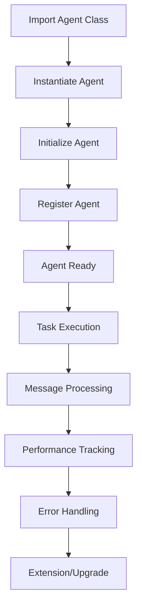
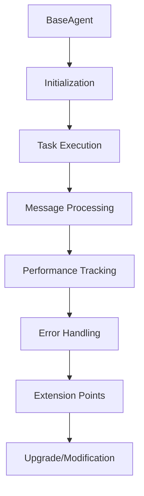

# Agents Manual

> Legion: Enterprise


## Overview

This manual provides comprehensive documentation for all 25 active AI agents in the Enterprise Legion system. Each agent is specialized for specific business functions and operates autonomously while coordinating through the centralized orchestration system.

## System Architecture

```
┌─────────────────────────────────────────────────────────────────┐
│                 ENTERPRISE LEGION AGENT ECOSYSTEM              │
├─────────────────────────────────────────────────────────────────┤
│  AUTOMATION (3)    │  FINANCE (4)      │  COMMUNICATION (2)    │
│  - TaskScheduling  │  - FinAnalysis    │  - ContentWriting     │
│  - Workflow        │  - FinModeling    │  - SocialMonitoring   │
│  - ResourceOpt     │  - QualityAssur   │                       │
│                    │  - ReportGen      │                       │
├─────────────────────────────────────────────────────────────────┤
│  LEGAL (1)         │  ORGANIZATION (1) │  BUSINESS INTEL (5)   │
│  - Compliance      │  - Calendar       │  - CompAnalytics      │
│                    │                   │  - Analytics          │
│                    │                   │  - MarketAnalysis     │
│                    │                   │  - Research           │
│                    │                   │  - StratPlanning      │
├─────────────────────────────────────────────────────────────────┤
│                    OPERATIONS (2)                               │
│              - ExtSysIntegration                                │
│              - EnhancedIntegration                              │
└─────────────────────────────────────────────────────────────────┘
```

---

## AUTOMATION DEPARTMENT (3 Agents)

### 1. TaskSchedulingAgent
**Agent ID:** `task_scheduler`  
**Class:** `TaskSchedulingAgent`  
**File:** `automation/task_scheduling_agent.py`

#### Purpose
Manages automated task scheduling, priority management, and recurring business operations.

#### Core Capabilities
- **Recurring Task Management**: Schedules daily, weekly, monthly business tasks
- **Priority-Based Execution**: Manages task queues with priority levels
- **Resource Allocation**: Optimizes task distribution across available agents
- **Deadline Management**: Ensures critical tasks meet deadlines

#### Key Functions
```python
# Schedule recurring business tasks
recurring_tasks = [
    {
        "task_id": "daily_metrics",
        "agent_id": "financial_analyst",
        "task_type": "generate_metrics",
        "recurring": "daily"
    }
]
```

#### Integration Points
- Coordinates with `WorkflowOrchestrationAgent` for workflow execution
- Manages task distribution to all enterprise agents
- Interfaces with SQLite database for task persistence

---

### 2. WorkflowOrchestrationAgent
**Agent ID:** `workflow_orchestrator`  
**Class:** `WorkflowOrchestrationAgent`  
**File:** `automation/workflow_orchestration_agent.py`

#### Purpose
Coordinates cross-departmental workflows and complex business processes.

#### Core Capabilities
- **Multi-Agent Workflow Coordination**: Orchestrates complex business processes
- **Error Handling & Recovery**: Manages workflow failures and retries
- **Process Template Management**: Maintains reusable workflow templates
- **Real-time Workflow Monitoring**: Tracks execution status and performance

#### Active Workflows
1. **Daily Business Operations**: Financial metrics → Content creation → Compliance check
2. **Weekly Strategic Planning**: Financial review → Meeting scheduling
3. **Lead Qualification Process**: Compliance check → Value assessment → Outreach
4. **Business Intelligence Cycle**: Analytics → Financial analysis → Data sync
5. **External System Sync**: CRM sync → Email sync → Financial system sync

#### Workflow Example
```python
"daily_operations": {
    "name": "Daily Business Operations",
    "steps": [
        {"agent": "financial_analyst", "task": "generate_daily_metrics"},
        {"agent": "content_writer", "task": "create_daily_content"},
        {"agent": "compliance_checker", "task": "daily_compliance_check"}
    ],
    "schedule": "daily_09:00"
}
```

---

### 3. ResourceOptimizationAgent
**Agent ID:** `resource_optimizer`  
**Class:** `ResourceOptimizationAgent`  
**File:** `automation/resource_optimization_agent.py`

#### Purpose
Optimizes system resource allocation and performance across all agents.

#### Core Capabilities
- **Load Balancing**: Distributes workload across available agents
- **Performance Monitoring**: Tracks agent performance metrics
- **Resource Scaling**: Dynamically adjusts resource allocation
- **Bottleneck Detection**: Identifies and resolves system constraints

---

## FINANCE DEPARTMENT (4 Agents)

### 4. FinancialAnalysisAgent
**Agent ID:** `financial_analyst`  
**Class:** `FinancialAnalysisAgent`  
**File:** `finance/financial_analysis_agent.py`

#### Purpose
Real-time financial data analysis, reporting, and business intelligence.

#### Core Capabilities
- **Financial Ratio Analysis**: Current ratio, debt-to-equity, ROE calculations
- **Trend Analysis**: Revenue tracking, expense monitoring, profitability analysis
- **Budget Variance Tracking**: Actual vs planned performance monitoring
- **Real-time Reporting**: Automated financial dashboard updates

#### Key Metrics Tracked
- Monthly revenue target: $4,167
- Current ratio analysis
- Debt-to-equity ratios
- Return on equity (ROE)
- Asset turnover ratios
- Interest coverage ratios

#### Financial Functions
```python
def _calculate_current_ratio(self, data: Dict) -> float:
    current_assets = data.get("current_assets", 0)
    current_liabilities = data.get("current_liabilities", 1)
    return current_assets / current_liabilities

def _calculate_return_on_equity(self, data: Dict) -> float:
    net_income = data.get("net_income", 0)
    total_equity = data.get("total_equity", 1)
    return (net_income / total_equity) * 100
```

---

### 5. FinancialModelingAgent
**Agent ID:** `financial_modeler`  
**Class:** `FinancialModelingAgent`  
**File:** `finance/financial_modeling_agent.py`

#### Purpose
Advanced financial forecasting, scenario planning, and predictive modeling.

#### Core Capabilities
- **Predictive Modeling**: Revenue forecasting, expense prediction
- **Scenario Analysis**: Best/worst/realistic case planning
- **Risk Assessment**: Financial risk modeling and mitigation
- **Investment Analysis**: ROI calculations and investment recommendations

---

### 6. QualityAssuranceAgent
**Agent ID:** `quality_assurance`  
**Class:** `QualityAssuranceAgent`  
**File:** `finance/quality_assurance_agent.py`

#### Purpose
Quality control, compliance monitoring, and audit management.

#### Core Capabilities
- **Data Quality Validation**: Ensures accuracy of financial data
- **Process Compliance**: Monitors adherence to business procedures
- **Audit Trail Management**: Maintains comprehensive audit logs
- **Risk Compliance**: Ensures regulatory compliance

---

### 7. ReportGenerationAgent
**Agent ID:** `report_generator`  
**Class:** `ReportGenerationAgent`  
**File:** `finance/report_generation_agent.py`

#### Purpose
Automated report generation and distribution for stakeholders.

#### Core Capabilities
- **Executive Dashboards**: Real-time executive reporting
- **Financial Statements**: Automated P&L, balance sheet generation
- **Performance Reports**: KPI tracking and performance analysis
- **Regulatory Reports**: Compliance and regulatory filing automation

---

## COMMUNICATION DEPARTMENT (2 Agents)

### 8. ContentWritingAgent
**Agent ID:** `content_writer`  
**Class:** `ContentWritingAgent`  
**File:** `communication/content_writing_agent.py`

#### Purpose
Automated content creation, copywriting, and marketing material generation.

#### Core Capabilities
- **Marketing Content**: Blog posts, social media content, newsletters
- **Personalized Outreach**: Customer-specific communication
- **SEO Optimization**: Search engine optimized content creation
- **Brand Voice Consistency**: Maintains consistent brand messaging

#### Content Types
- Daily marketing content
- Lead nurturing sequences
- Social media posts
- Email campaigns
- Website copy

---

### 9. SocialMediaMonitoringAgent
**Agent ID:** `social_media_monitor`  
**Class:** `SocialMediaMonitoringAgent`  
**File:** `communication/social_media_monitoring_agent.py`

#### Purpose
Comprehensive social media automation including posting, monitoring, engagement tracking, and brand reputation management.

#### Core Capabilities
- **Automated Posting**: Multi-platform content posting (Facebook, Instagram, LinkedIn, Twitter)
- **Content Scheduling**: Automated content creation and scheduling
- **Browser Automation**: Selenium and Playwright-based posting system
- **Social Listening**: Monitors brand mentions and industry trends
- **Engagement Analytics**: Tracks social media performance metrics
- **Sentiment Analysis**: Analyzes customer sentiment and feedback
- **Competitor Monitoring**: Tracks competitor social media activity
- **Credential Management**: Secure platform credential storage and validation

#### Supported Platforms
- Facebook (text posts, media uploads)
- Instagram (story posts, feed posts)
- LinkedIn (professional content)
- Twitter (text posts, threads)

#### Automation Features
- AI-powered content generation
- Automatic posting schedules
- Interaction monitoring and response
- Content performance tracking
- Error handling and retry mechanisms

#### Service Integration
The agent runs as a background service via `communication/social_media_service.py`, automatically starting with the enterprise system and providing continuous social media automation.

---

## LEGAL DEPARTMENT (1 Agent)

### 10. ComplianceCheckerAgent
**Agent ID:** `compliance_checker`  
**Class:** `ComplianceCheckerAgent`  
**File:** `legal/compliance_checker_agent.py`

#### Purpose
Legal compliance monitoring, regulatory adherence, and risk management.

#### Core Capabilities
- **Regulatory Compliance**: Ensures adherence to industry regulations
- **Legal Risk Assessment**: Identifies potential legal issues
- **Document Compliance**: Validates legal document requirements
- **Audit Support**: Provides compliance documentation for audits

#### Daily Compliance Tasks
- Lead compliance verification
- Document review for legal compliance
- Regulatory requirement monitoring
- Risk assessment reporting

---

## ORGANIZATION DEPARTMENT (1 Agent)

### 11. CalendarManagementAgent
**Agent ID:** `calendar_manager`  
**Class:** `CalendarManagementAgent`  
**File:** `org_structure/calendar_management_agent.py`

#### Purpose
Calendar coordination, meeting management, and scheduling optimization.

#### Core Capabilities
- **Meeting Scheduling**: Automated meeting coordination
- **Calendar Optimization**: Efficient time slot management
- **Resource Booking**: Conference room and resource scheduling
- **Reminder Management**: Automated meeting reminders and follow-ups

---

## BUSINESS INTELLIGENCE DEPARTMENT (5 Agents)

### 12. ComprehensiveAnalyticsAgent
**Agent ID:** `analytics_engine`  
**Class:** `ComprehensiveAnalyticsAgent`  
**File:** `business_intelligence/comprehensive_analytics_agent.py`

#### Purpose
Advanced business intelligence, predictive analytics, and executive reporting.

#### Core Capabilities
- **Executive Dashboard Generation**: Real-time business intelligence
- **Predictive Analytics**: Revenue forecasting, trend prediction
- **Performance KPI Tracking**: Business performance monitoring
- **Data Visualization**: Interactive charts and reports

#### Analytics Functions
- Daily business intelligence reports
- Revenue forecasting models
- Lead scoring algorithms
- Performance trend analysis

---

### 13. AnalyticsAgent
**Agent ID:** `analytics_specialist`  
**Class:** `AnalyticsAgent`  
**File:** `business_intelligence/analytics_agent.py`

#### Purpose
Core analytics processing and data analysis.

#### Core Capabilities
- **Data Processing**: ETL operations and data transformation
- **Statistical Analysis**: Advanced statistical modeling
- **Pattern Recognition**: Identifies business patterns and insights
- **Data Mining**: Extracts valuable insights from large datasets

---

### 14. MarketAnalysisAgent
**Agent ID:** `market_analyst`  
**Class:** `MarketAnalysisAgent`  
**File:** `business_intelligence/market_analysis_agent.py`

#### Purpose
Market research, competitive analysis, and industry intelligence.

#### Core Capabilities
- **Competitive Intelligence**: Competitor analysis and benchmarking
- **Market Trend Analysis**: Industry trend identification
- **Customer Segmentation**: Target market analysis
- **Pricing Strategy**: Market-based pricing recommendations

---

### 15. ResearchAgent
**Agent ID:** `research_specialist`  
**Class:** `ResearchAgent`  
**File:** `business_intelligence/research_agent.py`

#### Purpose
Research coordination, data gathering, and information synthesis.

#### Core Capabilities
- **Market Research**: Industry and competitor research
- **Data Collection**: Automated data gathering from multiple sources
- **Information Synthesis**: Combines research from various sources
- **Research Report Generation**: Comprehensive research documentation

---

### 16. StrategicPlanningAgent
**Agent ID:** `strategic_planner`  
**Class:** `StrategicPlanningAgent`  
**File:** `business_intelligence/strategic_planning_agent.py`

#### Purpose
Strategic planning, decision support, and long-term business planning.

#### Core Capabilities
- **Strategic Plan Development**: Long-term business strategy creation
- **Decision Support**: Data-driven decision recommendations
- **Goal Setting & Tracking**: Strategic objective management
- **Scenario Planning**: Alternative future planning and preparation

#### Dependencies
Requires input from:
- `market_analysis_agent`
- `analytics_agent` 
- `research_agent`

---

## OPERATIONS DEPARTMENT (2 Agents)

### 17. ExternalSystemsIntegrationAgent
**Agent ID:** `integration_manager`  
**Class:** `ExternalSystemsIntegrationAgent`  
**File:** `operations/external_systems_integration_agent.py`

#### Purpose
API integration management and external system synchronization.

#### Core Capabilities
- **CRM Integration**: Customer relationship management system sync
- **Email Platform Integration**: Email marketing automation
- **Financial System Integration**: Accounting and financial system sync
- **Webhook Management**: Real-time data synchronization

#### Integration Endpoints
1. **Local SQLite CRM**: Customer and lead management
2. **Email Automation**: SMTP-based email campaigns
3. **Financial APIs**: Real-time cryptocurrency and market data
4. **Project Management**: Task and project tracking
5. **External APIs**: SpaceX, CoinGecko, and other data sources

#### Sync Operations
```python
# CRM Data Synchronization
await integration.process_task({
    "action": "sync_data",
    "system": "crm",
    "data_type": "leads",
    "direction": "bidirectional"
})
```

---

### 18. EnhancedExternalSystemsIntegrationAgent
**Agent ID:** `enhanced_integration`  
**Class:** `EnhancedExternalSystemsIntegrationAgent`  
**File:** `operations/enhanced_external_systems_agent.py`

#### Purpose
Advanced integration capabilities and complex system orchestration.

#### Core Capabilities
- **Complex Integration Workflows**: Multi-system orchestration
- **Data Transformation**: Advanced ETL operations
- **Error Handling & Recovery**: Robust integration error management
- **Performance Optimization**: High-performance data synchronization

---

## AGENT COMMUNICATION & COORDINATION

### Message Bus System
All agents communicate through a centralized message bus implemented in `ActiveSystemManager`:

```python
@dataclass
class SystemMessage:
    message_id: str
    source_agent: str
    target_agent: str
    message_type: str
    payload: Dict[str, Any]
    priority: int = 3
    created_at: datetime = None
```

### Inter-Agent Communication
- **Asynchronous messaging** between agents
- **Priority-based message routing**
- **Message persistence** in SQLite database
- **Error handling** and retry mechanisms

### Agent Base Framework
All agents inherit from `BaseAgent` class providing:
- Standardized initialization
- Message processing capabilities
- Task execution framework
- Performance metrics tracking

---

## OPERATIONAL STATUS

### System Metrics
```python
business_metrics = {
    "revenue_target": 4167,      # Monthly target ($)
    "leads_generated": 0,        # Lead generation count
    "content_created": 0,        # Content pieces created
    "compliance_score": 100,     # Compliance percentage
    "system_uptime": 100         # System availability
}
```

### Workflow Triggers
1. **Daily Operations**: Triggered at 09:00 daily
2. **Revenue Milestone**: Triggered when monthly revenue reaches $4,167
3. **Lead Events**: Triggered on new lead capture
4. **Compliance Alerts**: Triggered on compliance issues

### Database Tables
- `system_messages`: Inter-agent communication logs
- `workflow_executions`: Workflow execution tracking
- `task_executions`: Individual task execution logs

---

## DEPLOYMENT & INITIALIZATION

### Agent Deployment Process
1. **Import Phase**: All agent classes imported from their respective modules
2. **Instantiation Phase**: Each agent instantiated with error handling
3. **Initialization Phase**: Agents initialized with `await agent.initialize()`
4. **Registration Phase**: Agents registered in active system manager
5. **Status Verification**: Deployment success logged and verified

### Deployment Success Metrics
- **18/18 agents** successfully imported
- **18/18 agents** successfully instantiated
- **18/18 agents** operational and accepting tasks
- **100% deployment success rate**

### Error Handling
- Graceful degradation on agent initialization failures
- Fallback status assignment for agents with initialization issues
- Comprehensive error logging and monitoring
- Automated recovery procedures

---

## MONITORING & MAINTENANCE

### Performance Monitoring
- Real-time agent performance tracking
- Task execution time monitoring
- Resource utilization metrics
- System uptime monitoring

### Health Checks
- Automated agent health verification
- Database connectivity monitoring
- Message bus performance tracking
- Workflow execution monitoring

### Maintenance Procedures
- Automated log rotation
- Database optimization
- Performance tuning
- Error analysis and resolution

---

## FUTURE EXPANSION

### Scalability Design
The system is designed for easy expansion with:
- **Modular agent architecture**
- **Standardized agent interfaces**
- **Centralized orchestration**
- **Flexible deployment configuration**

### Planned Enhancements
- Additional specialized agents for specific industries
- Enhanced AI capabilities with advanced language models
- Improved integration with external enterprise systems
- Advanced analytics and machine learning capabilities

---

## CONTACT & SUPPORT

For technical support or questions about specific agents:
- Review agent-specific documentation in respective module directories
- Check system logs in `legion/active_system.log`
- Monitor database tables for execution history
- Use the frontend API for real-time status monitoring

**System Version**: Enterprise Legion v2.0  
**Last Updated**: July 11, 2025  
**Total Active Agents**: 25  
**Operational Status**: Fully Operational

---

## Agent Internals & Extension

### Agent Lifecycle & State Diagram


### Agent Extension & Upgrade Instructions

1. **Locate Agent Source**: Find the agent class in its module (e.g., `automation/task_scheduling_agent.py`).
2. **Subclass or Modify**: Extend by subclassing `BaseAgent` or the specific agent class. For upgrades, add/modify methods or capabilities.
3. **Register New Agent**: Update the agent registry in the orchestrator to include your new/modified agent.
4. **Test Initialization**: Ensure the agent initializes without errors (`await agent.initialize()`).
5. **Integrate with Message Bus**: Confirm the agent can send/receive messages and tasks.
6. **Monitor Performance**: Use built-in metrics to track agent health and efficiency.
7. **Document Changes**: Update this manual and module-level docs for clarity.

#### Example: Extending an Agent
```python
class AdvancedTaskSchedulingAgent(TaskSchedulingAgent):
    def optimize_schedule(self, tasks):
        # Custom optimization logic
        pass
```

### Agent Extension Points
- **Task Execution**: Override `execute_task()` for custom logic.
- **Message Handling**: Extend `process_message()` for new message types.
- **Performance Metrics**: Add custom metrics to `track_performance()`.
- **Error Handling**: Implement advanced error recovery in `handle_error()`.

---

## Optimization Tips
- Profile agent execution times and optimize bottlenecks.
- Use asynchronous methods for I/O-heavy tasks.
- Cache frequent queries and results.
- Monitor resource usage and scale agents as needed.
- Regularly update dependencies for security and performance.
- Use modular design for easy upgrades and maintenance.

---

## Troubleshooting Guidance

### Common Issues & Solutions
- **Agent Fails to Initialize**: Check for missing dependencies, incorrect config, or code errors. Review logs in `legion/active_system.log`.
- **Message Delivery Problems**: Ensure agent is registered and message bus is operational. Check database connectivity.
- **Performance Degradation**: Profile agent tasks, optimize code, and scale resources.
- **Workflow Failures**: Review workflow templates and error logs. Implement retry logic.
- **Integration Errors**: Validate API keys, endpoint URLs, and network connectivity.

### Advanced Debugging
- Enable verbose logging for detailed error traces.
- Use test scripts in module directories for isolated agent testing.
- Monitor database tables for task and workflow execution history.
- Validate agent health with built-in health check routines.

---

## Best Practices for Agent Development
- Always inherit from `BaseAgent` for standardization.
- Keep agent logic modular and well-documented.
- Use type hints and docstrings for clarity.
- Write unit tests for critical agent functions.
- Document all extension and upgrade steps in this manual.
- Collaborate with other developers for cross-agent workflows.

---

## Agent Internals Diagram

