# Architectural Specifications

> Legion Enterprise 

## Overview

The Artifact XAI: Legion Enterprise System is a sophisticated multi-agent AI platform designed for enterprise-level business automation. It employs a microservices architecture with asynchronous communication, distributed data management, and comprehensive integration capabilities.

---

## Full System Schematic

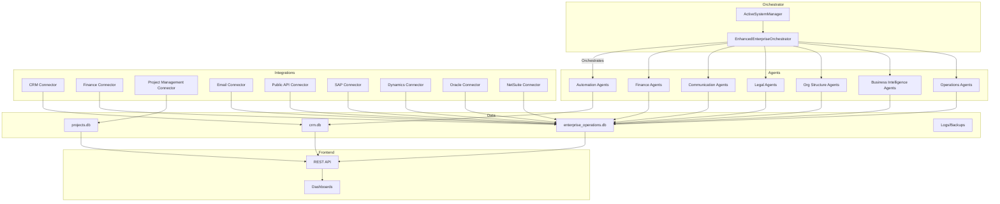

---

## Layer Breakdown

### Orchestration Layer
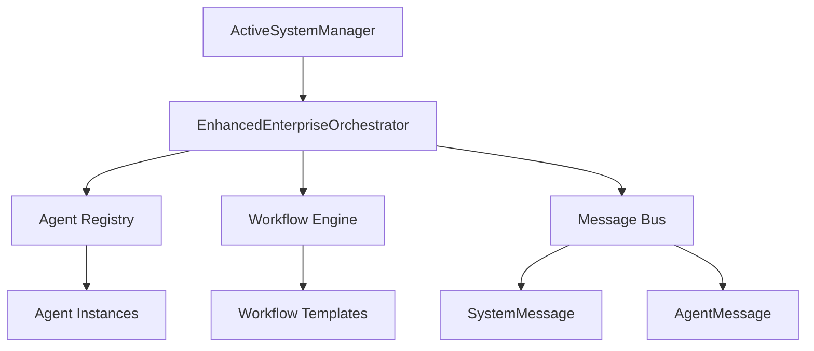

### Agent Layer
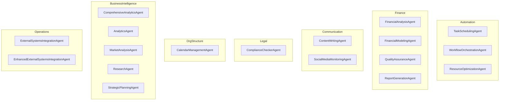

### Integration Layer
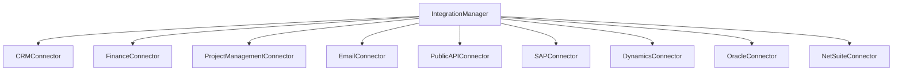

### Data Management Layer
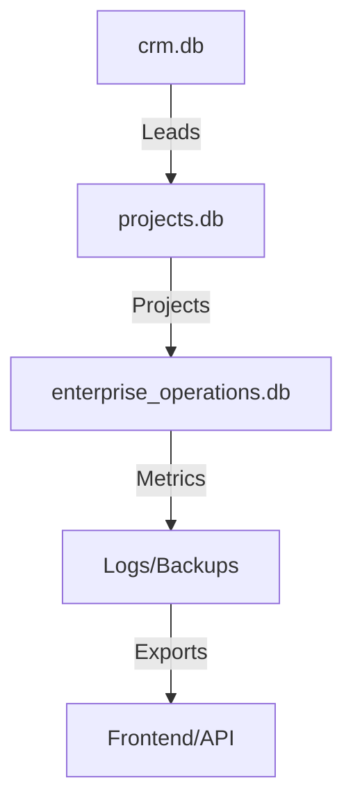

### Frontend/API Layer
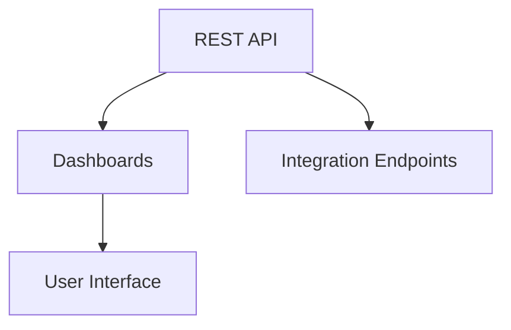

---

## Agent Internals & Lifecycle

### Agent Lifecycle Diagram
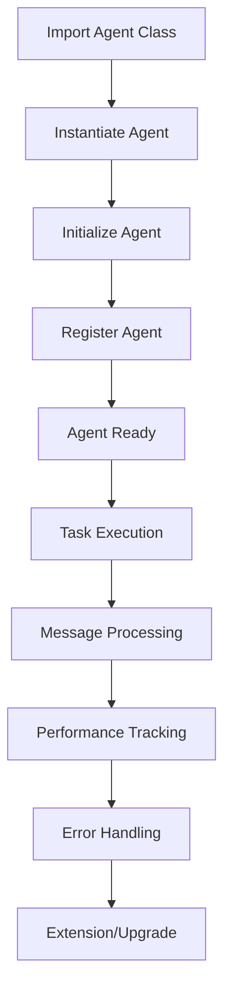

### Message Bus & Communication
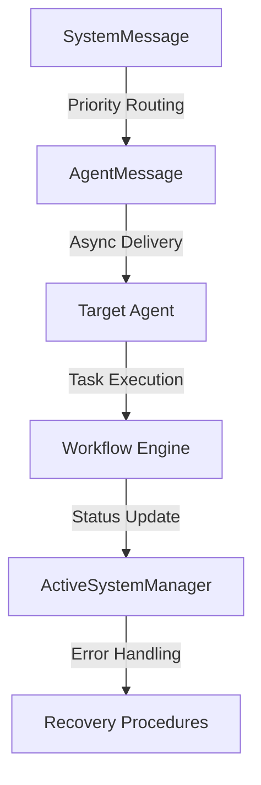

---

## Component Interactions

### Agent-Orchestrator-Integration Interaction
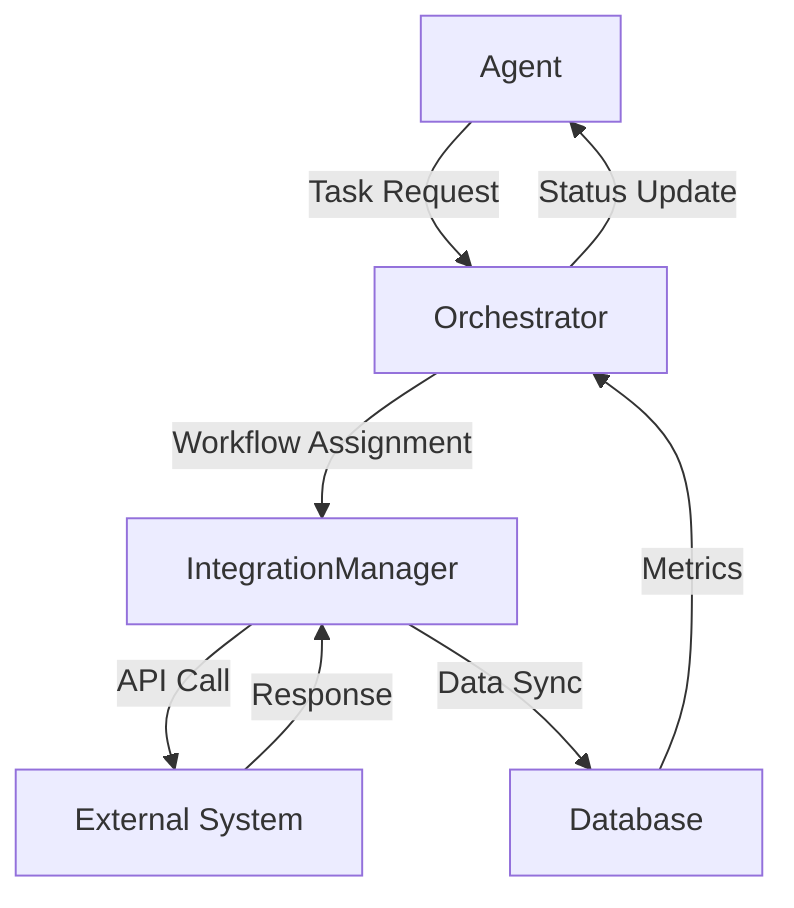

---

## Integration Endpoints (Cloud ERP)

### Foundationed/In-Progress Connectors
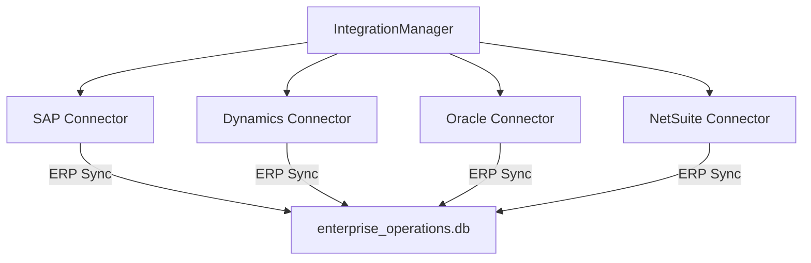

---

## Organization Topology

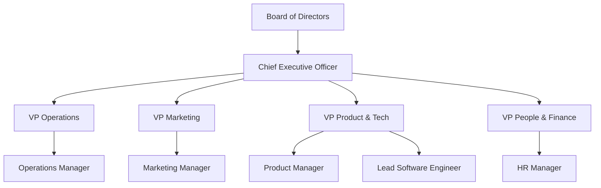

