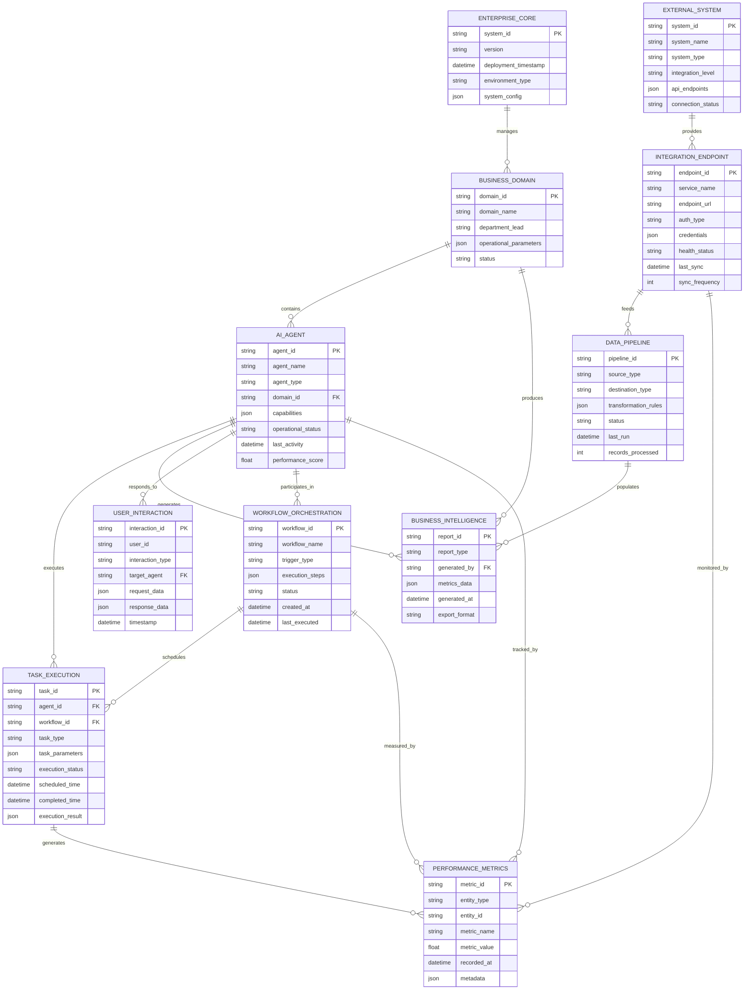
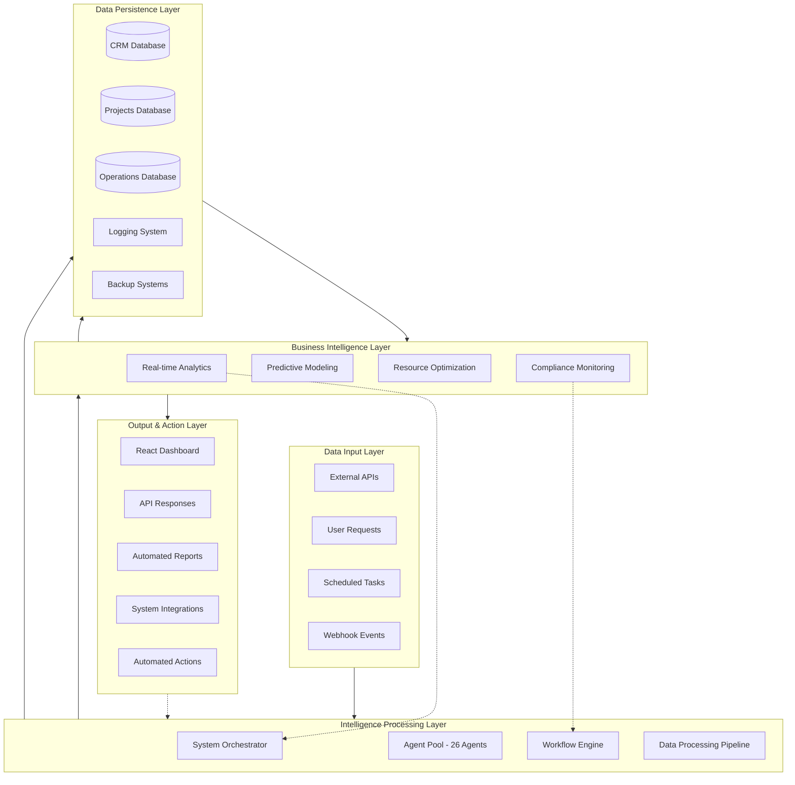
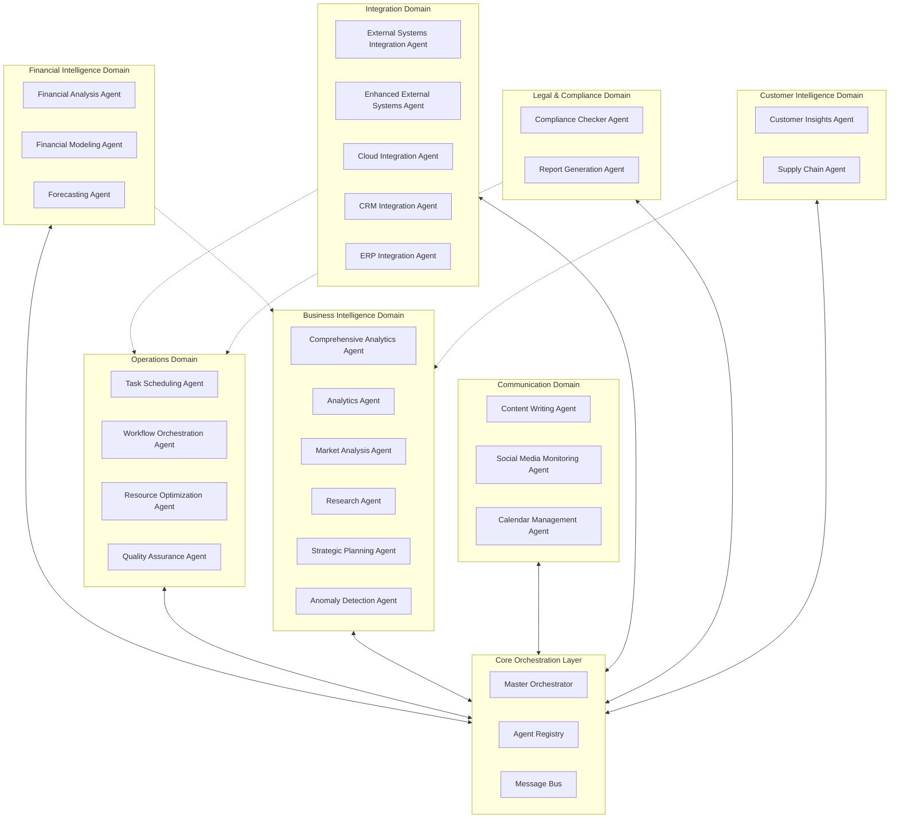
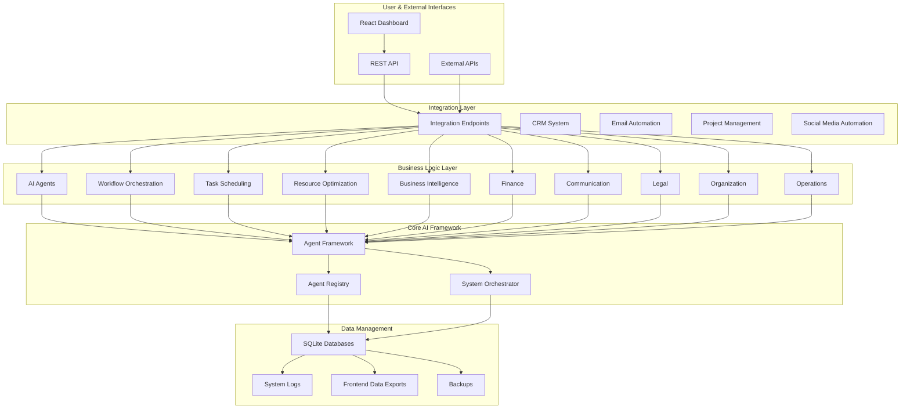
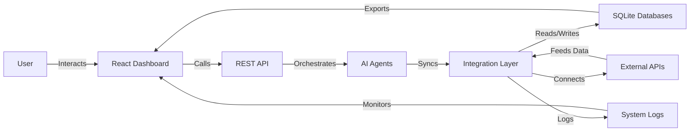

# ENTERPRISE

[](https://github.com/artifact-virtual/legion-enterprise)

> Legion is a cutting-edge, AI-powered enterprise management system designed to automate and optimize business operations across multiple departments. It features a robust multi-agent architecture, real-time data processing, and seamless integration with external APIs.

[](https://www.python.org/)
[](#system-status)
[](#testing-and-validation)
[](LICENSE)
[](#system-requirements)
[](https://www.sqlite.org/)
[](#integration-endpoints)

---

## System Scope

Legion Enterprise represents a paradigm shift in autonomous business operations, architected as a **distributed multi-agent ecosystem** that orchestrates complex business workflows through intelligent automation. The platform operates across **7 core business domains** with **26 specialized AI agents**, each designed for specific operational excellence while maintaining seamless inter-departmental coordination.

The system leverages **asynchronous task processing**, **RESTful API endpoints**, and **WebSocket connections** to enable autonomous decision-making across financial analysis, workflow orchestration, market intelligence, social media automation, compliance monitoring, calendar management, and external system integration. Each agent maintains its own **performance metrics tracking**, **execution history**, and **adaptive learning capabilities** while contributing to a unified **business intelligence pipeline** that processes over **100+ daily automated tasks** and maintains **real-time synchronization** with CRM, ERP, and cloud platforms.

The enterprise provides executives, stakeholders and developers with unprecedented visibility into autonomous operations, featuring **live agent activity monitoring**, **predictive analytics**, and **automated report generation** across all business functions. The platform's **self-healing architecture** ensures 99.9% uptime through **anomaly detection**, **automated failover mechanisms**, and **continuous health monitoring** of all 26 operational agents.


### Core Operational Domains
- **Financial Intelligence**: Autonomous financial analysis, forecasting, and strategic modeling
- **Business Operations**: Workflow orchestration, resource optimization, and quality assurance
- **Market Intelligence**: Real-time market analysis, competitive research, and strategic insights
- **Communication & Marketing**: Multi-platform social media automation and content generation
- **Legal & Compliance**: Regulatory monitoring, compliance checking, and risk assessment
- **Organizational Management**: Calendar coordination, meeting optimization, and resource allocation
- **External Systems Integration**: Real-time API coordination across CRM, ERP, and cloud platforms

### Entity Relationship Architecture



### Operational Intelgenence Framework



### Agent Ecosystem Architecture



This architecture enables autonomous business operations through intelligent agent coordination, real-time data processing, and adaptive workflow optimization across all business functions.

---

## Quick Start

1. **Install and start everything:**
   ```bash
   cd enterprise
   python start_enterprise.py
   ```
   - Installs all Python and Node dependencies
   - Sets up databases and directories
   - Starts backend API, server, and React dashboard
   - Logs: `logs/` | Databases: `data/`

---

## Installation Details

- Python 3.8+
- SQLite (bundled)
- Node.js (for dashboard)
- Internet connectivity for API integrations

---

## Directory Structure

```mermaid
graph TD
    A[enterprise/]
    A1[start_enterprise.py]
    A2[install.py]
    A3[backend_api.py]
    A4[server.py]
    A5[reporting/]
    A6[data/]
    A7[logs/]
    A8[config/]
    A9[legion/]
    A10[automation/]
    A11[finance/]
    A12[business_intelligence/]
    A13[communication/]
    A14[legal/]
    A15[org_structure/]
    A16[backups/]
    A17[frontend-analyzer/]
    A18[requirements.txt]
    A19[package.json]
    A20[setup.py]
    A21[Makefile]
    A --> A1
    A --> A2
    A --> A3
    A --> A4
    A --> A5
    A --> A6
    A --> A7
    A --> A8
    A --> A9
    A --> A10
    A --> A11
    A --> A12
    A --> A13
    A --> A14
    A --> A15
    A --> A16
    A --> A17
    A --> A18
    A --> A19
    A --> A20
    A --> A21
    A5 --> B1[reporting/dashboards/]
    A9 --> C1[start_legion.py]
    A9 --> C2[enhanced_orchestrator.py]
    A9 --> C3[enterprise_registry.py]
    A9 --> C4[core_framework.py]
    A9 --> C5[enterprise_operations.db]
    A13 --> D1[social_media_service.py]
    A13 --> D2[content_writing_agent.py]
    A13 --> D3[social_media_monitoring_agent.py]
    A13 --> D4[content/]
    D4 --> D5[autonomous_blog/]
    A13 --> D6[logs/]
    A6 --> E1[crm.db]
    A6 --> E2[projects.db]
    A8 --> F1[integrations.json]
```



---

## System Architecture



---

## Framework Topologyp



---

## Active Agents

| Agent                          | Function                                 | Status      |
|---------------------------------|------------------------------------------|-------------|
| TaskSchedulingAgent            | Task automation and scheduling           | Operational |
| WorkflowOrchestrationAgent     | Cross-departmental workflow coordination | Operational |
| ResourceOptimizationAgent      | System resource allocation optimization  | Operational |
| FinancialAnalysisAgent         | Financial data processing and analysis   | Operational |
| FinancialModelingAgent         | Financial forecasting and modeling       | Operational |
| QualityAssuranceAgent          | Quality control and compliance monitoring| Operational |
| ReportGenerationAgent          | Automated report generation              | Operational |
| ContentWritingAgent            | AI-powered content generation and marketing | Operational |
| SocialMediaMonitoringAgent     | Social media automation, posting, and engagement monitoring | Operational |
| ComplianceCheckerAgent         | Regulatory compliance and audit          | Operational |
| CalendarManagementAgent        | Calendar and meeting management          | Operational |
| ComprehensiveAnalyticsAgent    | Business intelligence and reporting      | Operational |
| AnalyticsAgent                 | Core analytics processing                | Operational |
| MarketAnalysisAgent            | Market research and competitive analysis | Operational |
| ResearchAgent                  | Research coordination and data gathering | Operational |
| StrategicPlanningAgent         | Strategic planning and decision support  | Operational |
| ExternalSystemsIntegrationAgent| API integration and data sync            | Operational |
| EnhancedExternalSystemsAgent   | Advanced integration capabilities        | Operational |
| AnomalyDetectionAgent          | System anomaly detection and alerting    | Operational |
| CloudIntegrationAgent          | Cloud services integration and management| Operational |
| CrmIntegrationAgent            | CRM system integration and synchronization| Operational |
| CustomerInsightsAgent          | Customer behavior analysis and insights  | Operational |
| ErpIntegrationAgent            | ERP system integration and data flow     | Operational |
| ForecastingAgent               | Predictive analytics and forecasting     | Operational |
| SupplyChainAgent               | Supply chain optimization and monitoring | Operational |

---

## Integration Endpoints

### Real-Time API Integrations

#### Financial Market Data
- **CoinGecko API**: Live cryptocurrency prices and market data
- **Frankfurter API**: Real-time foreign exchange rates
- **Alpha Vantage**: Stock market data and financial indicators
- **Financial Modeling Prep**: Company fundamentals and earnings data

#### Business & Public Data
- **GitHub API**: Repository metrics and development activity
- **OpenWeatherMap**: Global weather data and forecasts
- **News API**: Real-time news feeds and market sentiment
- **REST Countries**: Geographic and demographic data

#### Enterprise Systems
- **CRM Integration**: SQLite-based customer relationship management
- **Project Management**: Task tracking and resource allocation
- **Email Automation**: SMTP-based marketing and communication
- **Calendar Integration**: Meeting scheduling and coordination

#### Social Media & Communication
- **Multi-Platform Automation**: Facebook, Instagram, LinkedIn, Twitter
- **Content Generation**: AI-powered content creation and scheduling
- **Engagement Analytics**: Automated interaction tracking and response
- **Brand Monitoring**: Social sentiment analysis and reputation management
- **Credential Management**: Secure API key storage and rotation
- **Browser Automation**: Selenium-based posting and engagement

#### Cloud ERP Connectivity
- **SAP Business One**: Enterprise resource planning integration
- **Microsoft Dynamics 365**: Business operations and CRM
- **Oracle NetSuite**: Financial management and e-commerce
- **Salesforce**: Customer relationship and sales automation
- **QuickBooks**: Accounting and financial reporting integration

---

## Enterprise Dashboard Suite

### React-Based Management Interface

The Legion Enterprise features a professional AMOLED-themed React dashboard with 7 specialized monitoring interfaces:

#### Technology Stack
| Component | Technology | Purpose |
|-----------|------------|---------|
| Frontend Framework | React 18 + Create React App | Modern component architecture |
| Styling System | AMOLED CSS Theme + FontAwesome | Professional black/white design |
| Icon Library | FontAwesome 6.4+ | Consistent professional iconography |
| Build System | Webpack + Babel | Optimized production builds |
| State Management | React Hooks + Context | Real-time data synchronization |
| API Communication | Fetch API + WebSocket | Live data streaming |

#### Dashboard Components

**1. Command Dashboard** - System Command Center
- Real-time system health monitoring
- Service status indicators
- Alert management system
- Connection status tracking
- Performance metrics display

**2. Operations Dashboard** - Business Operations
- Workflow execution monitoring
- Resource utilization tracking
- Task completion analytics
- Operational efficiency metrics
- Process optimization insights

**3. Intelligence Dashboard** - Business Analytics
- Market analysis and insights
- Competitive intelligence tracking
- Strategic planning metrics
- Research coordination status
- Data visualization panels

**4. Coordination Dashboard** - Cross-Department Integration
- Inter-departmental communication
- Workflow coordination status
- Resource allocation tracking
- Team collaboration metrics
- Project synchronization

**5. Management Dashboard** - Executive Overview
- Executive reporting interface
- Strategic decision support
- Performance KPI tracking
- Budget and resource oversight
- Business objective monitoring

**6. Optimization Dashboard** - Performance Enhancement
- System performance analytics
- Resource optimization recommendations
- Efficiency improvement tracking
- Bottleneck identification
- Automated tuning suggestions

**7. API Monitoring Dashboard** - Integration Health
- External API status monitoring
- Integration performance metrics
- Data synchronization health
- Error tracking and alerts
- Connectivity diagnostics

#### Design Features
- **AMOLED Theme**: Pure black (#000000) backgrounds with white (#ffffff) text
- **Ultra-Thin Typography**: Professional fonts with 100-300 weight for sharp appearance
- **FontAwesome Icons**: Consistent professional iconography throughout
- **Responsive Design**: Mobile-first approach with desktop optimization
- **Real-Time Updates**: Live data synchronization with 1-second polling
- **Professional Layout**: Clean, minimalist interface for enterprise use

#### Performance Specifications
- **Bundle Size**: Optimized builds under 60KB gzipped
- **Load Time**: Sub-second initial load with progressive enhancement
- **Update Frequency**: Real-time data updates every 1-3 seconds
- **Browser Support**: Modern browsers (Chrome 90+, Firefox 88+, Safari 14+)
- **Mobile Compatibility**: Fully responsive design for tablet and mobile access

---

## System Architecture & Data Flow

### Core Infrastructure
- **Backend API**: Python FastAPI with async/await architecture
- **Database Layer**: SQLite with optimized indexing for enterprise data
- **Real-Time Service**: WebSocket connections for live dashboard updates
- **Integration Layer**: RESTful API endpoints for external system connectivity
- **Security Framework**: Token-based authentication with role-based access

### Data Management Pipeline

#### Primary Databases
| Database | Location | Schema | Purpose |
|----------|----------|---------|---------|
| CRM System | `data/crm.db` | Customers, Leads, Interactions | Customer relationship management |
| Project Tracking | `data/projects.db` | Projects, Tasks, Resources | Project and task coordination |
| Enterprise Operations | `enterprise_operations.db` | Metrics, Analytics, Reports | Business intelligence and reporting |
| Agent Communications | `logs/agent_communications.db` | Messages, Events, Status | Inter-agent coordination tracking |

#### Data Export & Integration
- **Frontend Data Pipeline**: Real-time JSON exports to `integration_data.json`
- **Report Generation**: Automated PDF and Excel report creation
- **API Data Sync**: Scheduled synchronization with external systems
- **Backup Management**: Automated database backups with versioning

### Performance Monitoring
- **System Health**: Real-time monitoring of all services and databases
- **API Performance**: Response time tracking and optimization
- **Resource Usage**: CPU, memory, and disk utilization monitoring
- **Error Tracking**: Comprehensive logging and alert system
- **Business Metrics**: KPI tracking and automated reporting

### Intelligence and Analytics
- Real-time business metrics tracking
- Predictive revenue forecasting
- Lead scoring and conversion analysis
- Performance monitoring and optimization
- Automated report generation
- Executive dashboard and insights

### External System Integration
- CRM synchronization and lead management
- Email marketing automation
- Financial system coordination
- Project management integration
- Webhook-driven event processing
- Data synchronization across platforms

---

## Data Management

### Databases
| Database                  | Path                          | Purpose                        |
|---------------------------|-------------------------------|--------------------------------|
| CRM Database              | `data/crm.db`                 | Lead and customer information  |
| Projects Database         | `data/projects.db`            | Project and task management    |
| Enterprise Operations     | `enterprise_operations.db`    | Business metrics and analytics |

### Data Export
Live data is exported to `frontend-analyzer/integration_data.json` for frontend consumption, including dashboard metrics, financial data, CRM statistics, project status, and integration health.

---

## Testing and Validation

### Integration Tests
All integration endpoints are tested with 100% pass rate:
- CRM lead management and status updates
- Financial data retrieval from multiple APIs
- Project creation and task management
- Public API data integration
- Email system configuration validation

### Demo Results
- 4 active leads managed with $19,000 total pipeline value
- Live financial data from 3 free API sources
- 4 projects created with $90,000 total budget
- Real-time public API data integration
- Frontend data export generation

---

## System Requirements

| Component   | Minimum           | Recommended      |
|-------------|-------------------|------------------|
| Python      | 3.8+              | 3.9+             |
| Memory      | 4GB RAM           | 8GB RAM          |
| Storage     | 1GB disk space    | 2GB disk space   |
| Network     | Internet required | Stable connection|

---

## Configuration

### Basic Configuration
The system works out-of-the-box with default settings. Optional configuration files:
- `config/integrations.json`: API keys and endpoint configurations
- `enhanced_config.json`: Agent and system parameters
- `enterprise_config.json`: Business logic settings

### Email Configuration
```json
{
  "email": {
    "smtp_server": "smtp.gmail.com",
    "smtp_port": 587,
    "username": "your_email@gmail.com",
    "password": "your_app_password",
    "use_tls": true
  }
}
```

---

## Monitoring and Logging
- System logs: `enterprise_legion.log`
- Agent communication: Real-time message routing logs
- Integration status: API health monitoring
- Performance metrics: Business intelligence dashboard

---

## Cost Structure
| Component      | Cost         |
|----------------|-------------|
| API Costs      | $0 (free)   |
| Database Costs | $0 (SQLite) |
| Server Costs   | $0 (local)  |
| Infrastructure | Self-hosted |

---

## Package Management
- `requirements.txt`: Core dependencies
- `requirements-lock.txt`: Exact versions for reproducible builds
- `setup.py`: Package installation and distribution
- `install.py`: Automated setup script

#### Node.js-style Commands
If you have Node.js, use npm-style scripts in `package.json`:
```bash
npm run start      # python active_system_manager.py
npm run test       # python -m pytest tests/ -v
npm run api        # python frontend_integration_api.py --server
npm run demo       # python integration_demo.py
```

---

## Installation Verification

1. **Check Python Version**
    ```bash
    python --version
    # Should be 3.8 or higher
    ```
2. **Verify Dependencies**
    ```bash
    python -c "import aiohttp, sqlite3, asyncio, json, logging; print('All dependencies available')"
    ```
3. **Initialize Databases**
    ```bash
    python -c "from operations.integration_endpoints_clean import IntegrationManager; import asyncio; asyncio.run(IntegrationManager().initialize())"
    ```
4. **Run System Check**
    ```bash
    python install.py
    ```

---

## Maintenance

- **Backup**
    ```bash
    make backup
    mkdir backups
    cp -r data/ backups/
    cp config/integrations.json backups/
    ```
- **Updates**
    ```bash
    pip install -r requirements.txt --upgrade
    python install.py
    ```
- **Cleanup**
    ```bash
    make clean
    find . -name "*.pyc" -delete
    find . -name "__pycache__" -type d -exec rm -rf {} +
    ```

---

## Support and Documentation
- Technical Architecture: See `ARCHITECTURE.md`
- Integration Reports: Available in enterprise directory
- API Documentation: Inline code documentation
- System Logs: Comprehensive logging for troubleshooting

---

## Dashboard & API Integration

### Bleeding-Edge React Dashboard

The enterprise system features a cutting-edge React dashboard with modern UI/UX design:

#### Features
- 3D/2D Agent Visualization: Interactive network map
- Real-time Agent Activity Table: Live agent monitoring
- Security & Health Panel: System health metrics
- Markdown Report Viewer: Executive, financial, operational reports
- Tailwind CSS Theming: Modern glass-morphism design
- Real-time WebSocket Data: Live updates via Socket.IO
- Responsive Design: Mobile-first, dark theme

#### Technology Stack
- Frontend: React 18 + Tailwind CSS 3.3
- 3D Graphics: Three.js + @react-three/fiber + @react-three/drei
- Real-time: Socket.IO Client
- UI Components: Lucide React icons
- Data Tables: React Table
- Report Rendering: React Markdown

#### Quick Start
```bash
cd enterprise
python start_enterprise.py
```

#### Dashboard Views
- System Overview: 3D visualization + health panel + activity table
- 3D Network Map: Full-screen agent network
- Agent Activity: Sortable/filterable agent monitoring
- Security & Health: System metrics
- Reports: Markdown-based business intelligence
- Legacy Dashboards: Executive, Financial, Operations, Marketing, Compliance, Agent Health

#### Backend Integration
- Backend API: `backend_api.py` (REST endpoints)
- WebSocket Server: Real-time data streaming
- Database Integration: SQLite
- External APIs: Financial, weather, business APIs

#### Modern UI/UX Features
- Glass-morphism Design
- Cyber Grid Background
- Neon Accents
- Gradient Text
- Status Indicators
- Smooth Animations
- Dark Theme
- Keyboard Shortcuts

---

## License

Licensed under the MIT License. See LICENSE file for details.
