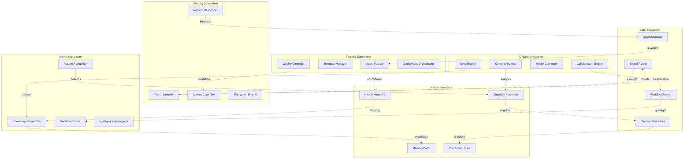
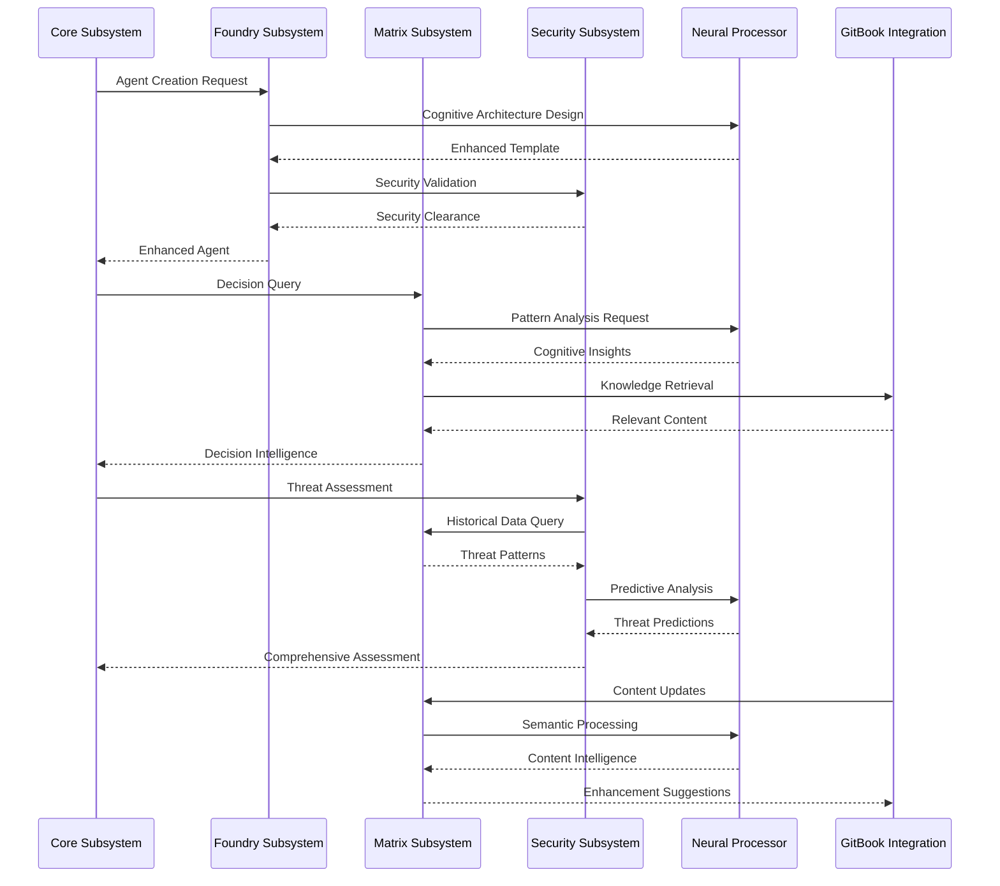

# Nerve Centre (NC) - Subsystem Integration Overview

## Executive Summary

This document provides a comprehensive overview of how all Nerve Centre subsystems integrate through the node-edge architecture to create a unified, intelligent, and self-optimizing enterprise AI platform. Each subsystem operates as a collection of intelligent nodes connected through weighted edges that enable mathematical optimization of the entire system.

## Node-Edge Architecture Overview

### Unified Node-Edge Topology



### Mathematical Foundation of Node-Edge Integration

```python
class NCNodeEdgeArchitecture:
    def __init__(self):
        self.subsystem_graph = nx.MultiDiGraph()
        self.integration_matrix = np.zeros((NUM_SUBSYSTEMS, NUM_SUBSYSTEMS))
        self.optimization_weights = np.ones(NUM_SUBSYSTEMS)
        self.golden_ratio = (1 + math.sqrt(5)) / 2
        
    def calculate_system_harmony(self) -> float:
        """
        Calculate overall system harmony using golden ratio optimization
        H = φ * Σ(subsystem_efficiency_i * integration_score_i * performance_i)
        """
        total_harmony = 0
        
        for subsystem in self.get_all_subsystems():
            efficiency = subsystem.calculate_efficiency()
            integration = self.calculate_integration_score(subsystem)
            performance = subsystem.get_performance_score()
            
            # Apply golden ratio for high-performing subsystems
            if performance > 0.8:
                contribution = self.golden_ratio * efficiency * integration * performance
            else:
                contribution = efficiency * integration * performance
                
            total_harmony += contribution
        
        return total_harmony / len(self.get_all_subsystems())
```

## Subsystem Integration Patterns

### 1. Core ↔ All Subsystems Integration

The Core subsystem serves as the central orchestrator, maintaining connections to all other subsystems:

```python
class CoreIntegrationOrchestrator:
    def orchestrate_subsystem_coordination(self) -> CoordinationResult:
        """Orchestrate coordination across all NC subsystems"""
        
        # Core → Foundry: Agent creation requests
        foundry_requests = self.core.get_agent_creation_requests()
        foundry_responses = self.foundry.process_creation_requests(foundry_requests)
        
        # Core → Matrix: Decision support queries
        decision_queries = self.core.get_decision_queries()
        matrix_intelligence = self.matrix.provide_decision_intelligence(decision_queries)
        
        # Core → Security: Threat assessment requests
        security_queries = self.core.get_security_queries()
        security_intelligence = self.security.provide_threat_intelligence(security_queries)
        
        # Core → Neural: Cognitive processing requests
        cognitive_requests = self.core.get_cognitive_requests()
        neural_results = self.neural.process_cognitive_requests(cognitive_requests)
        
        # Core → GitBook: Knowledge synchronization
        sync_requests = self.core.get_sync_requests()
        gitbook_sync = self.gitbook.synchronize_knowledge(sync_requests)
        
        # Apply golden ratio optimization for coordination
        phi = (1 + math.sqrt(5)) / 2
        coordination_scores = self.calculate_coordination_scores([
            foundry_responses, matrix_intelligence, security_intelligence,
            neural_results, gitbook_sync
        ])
        
        optimized_coordination = {}
        for subsystem, score in coordination_scores.items():
            if score > 0.8:
                optimized_coordination[subsystem] = score * phi
            else:
                optimized_coordination[subsystem] = score
        
        return CoordinationResult(
            coordination_scores=optimized_coordination,
            overall_harmony=self.calculate_overall_harmony(optimized_coordination)
        )
```

### 2. Foundry ↔ Neural Processor Integration

Deep integration for intelligent agent creation and optimization:

```python
class FoundryNeuralIntegration:
    def create_neural_enhanced_agent(
        self, 
        requirements: AgentRequirements
    ) -> NeuralEnhancedAgent:
        """Create agent with neural processor enhancement"""
        
        # Foundry analyzes requirements
        foundry_analysis = self.foundry.analyze_requirements(requirements)
        
        # Neural processor provides cognitive architecture
        cognitive_architecture = self.neural.design_cognitive_architecture(
            foundry_analysis
        )
        
        # Foundry incorporates neural capabilities
        enhanced_template = self.foundry.enhance_template_with_neural(
            foundry_analysis.optimal_template, cognitive_architecture
        )
        
        # Neural processor validates cognitive integration
        validation_result = self.neural.validate_cognitive_integration(
            enhanced_template
        )
        
        # Create agent with neural enhancement
        agent = self.foundry.create_agent(enhanced_template)
        
        # Neural processor provides learning capabilities
        learning_system = self.neural.create_learning_system(agent)
        
        return NeuralEnhancedAgent(
            base_agent=agent,
            cognitive_architecture=cognitive_architecture,
            learning_system=learning_system,
            neural_integration_score=validation_result.integration_score
        )
```

### 3. Matrix ↔ GitBook Integration

Seamless knowledge flow and documentation intelligence:

```python
class MatrixGitBookIntegration:
    def synchronize_knowledge_intelligence(self) -> KnowledgeSyncResult:
        """Synchronize knowledge between Matrix and GitBook"""
        
        # GitBook provides content updates
        content_updates = self.gitbook.get_content_updates()
        
        # Matrix processes content for knowledge extraction
        knowledge_extraction = self.matrix.extract_knowledge(content_updates)
        
        # Matrix updates knowledge graph
        graph_updates = self.matrix.update_knowledge_graph(knowledge_extraction)
        
        # GitBook receives intelligence insights
        intelligence_insights = self.matrix.generate_content_insights(graph_updates)
        
        # GitBook optimizes content based on insights
        content_optimization = self.gitbook.optimize_content(intelligence_insights)
        
        # Calculate synchronization effectiveness
        phi = (1 + math.sqrt(5)) / 2
        sync_effectiveness = self.calculate_sync_effectiveness(
            knowledge_extraction, content_optimization
        )
        
        if sync_effectiveness > 0.8:
            optimized_effectiveness = sync_effectiveness * phi
        else:
            optimized_effectiveness = sync_effectiveness
        
        return KnowledgeSyncResult(
            knowledge_extraction=knowledge_extraction,
            content_optimization=content_optimization,
            sync_effectiveness=min(optimized_effectiveness, 1.0),
            bidirectional_enhancement=self.calculate_bidirectional_enhancement(
                graph_updates, content_optimization
            )
        )
```

### 4. Security ↔ All Subsystems Integration

Comprehensive security orchestration across the entire NC:

```python
class SecurityIntegrationOrchestrator:
    def orchestrate_security_across_subsystems(self) -> SecurityOrchestrationResult:
        """Orchestrate security across all NC subsystems"""
        
        security_assessments = {}
        
        # Core security integration
        core_security = self.security.assess_core_security(self.core)
        security_assessments['core'] = core_security
        
        # Foundry security integration
        foundry_security = self.security.validate_agent_creation_security(self.foundry)
        security_assessments['foundry'] = foundry_security
        
        # Matrix security integration
        matrix_security = self.security.secure_knowledge_operations(self.matrix)
        security_assessments['matrix'] = matrix_security
        
        # Neural security integration
        neural_security = self.security.secure_neural_processing(self.neural)
        security_assessments['neural'] = neural_security
        
        # GitBook security integration
        gitbook_security = self.security.secure_content_synchronization(self.gitbook)
        security_assessments['gitbook'] = gitbook_security
        
        # Apply golden ratio optimization for critical security scores
        phi = (1 + math.sqrt(5)) / 2
        optimized_security = {}
        
        for subsystem, assessment in security_assessments.items():
            if assessment.threat_level < 0.2:  # Low threat = high security
                optimized_score = assessment.security_score * phi
            else:
                optimized_score = assessment.security_score
                
            optimized_security[subsystem] = min(optimized_score, 1.0)
        
        return SecurityOrchestrationResult(
            security_assessments=security_assessments,
            optimized_security_scores=optimized_security,
            overall_security_posture=self.calculate_overall_security_posture(optimized_security),
            threat_landscape=self.analyze_cross_subsystem_threats(security_assessments)
        )
```

## Data Flow Architecture

### Cross-Subsystem Data Flow



### Real-Time Event Processing

```python
class NCEventProcessor:
    def __init__(self):
        self.event_graph = nx.DiGraph()
        self.processing_pipeline = self.build_processing_pipeline()
        self.golden_ratio = (1 + math.sqrt(5)) / 2
        
    def process_cross_subsystem_event(self, event: NCEvent) -> EventProcessingResult:
        """Process events across all NC subsystems with optimization"""
        
        processing_results = []
        
        # Route event to relevant subsystems
        target_subsystems = self.determine_target_subsystems(event)
        
        for subsystem in target_subsystems:
            # Process event in subsystem
            subsystem_result = subsystem.process_event(event)
            
            # Apply golden ratio optimization for high-priority events
            if event.priority > 0.8:
                optimized_impact = subsystem_result.impact_score * self.golden_ratio
            else:
                optimized_impact = subsystem_result.impact_score
            
            processing_results.append(SubsystemProcessingResult(
                subsystem_id=subsystem.id,
                result=subsystem_result,
                optimized_impact=min(optimized_impact, 1.0)
            ))
        
        # Cross-subsystem event correlation
        event_correlations = self.correlate_cross_subsystem_events(
            event, processing_results
        )
        
        return EventProcessingResult(
            event_id=event.id,
            processing_results=processing_results,
            event_correlations=event_correlations,
            overall_impact=self.calculate_overall_impact(processing_results),
            optimization_applied=event.priority > 0.8
        )
```

## Performance Optimization Framework

### Golden Ratio System Optimization

```python
class GoldenRatioOptimizer:
    def __init__(self):
        self.phi = (1 + math.sqrt(5)) / 2
        self.optimization_history = []
        
    def optimize_nc_system_performance(self) -> SystemOptimization:
        """Optimize entire NC system using golden ratio principles"""
        
        # Collect performance metrics from all subsystems
        subsystem_metrics = self.collect_subsystem_metrics()
        
        # Calculate optimization opportunities
        optimization_opportunities = {}
        
        for subsystem_id, metrics in subsystem_metrics.items():
            # Identify high-performing components
            high_performers = [m for m in metrics if m.performance_score > 0.8]
            
            # Apply golden ratio scaling
            for metric in high_performers:
                optimized_score = metric.performance_score * self.phi
                optimization_opportunities[f"{subsystem_id}_{metric.id}"] = OptimizationOpportunity(
                    current_score=metric.performance_score,
                    optimized_score=min(optimized_score, 1.0),
                    improvement_potential=optimized_score - metric.performance_score,
                    subsystem=subsystem_id
                )
        
        # Implement optimization
        implementation_results = self.implement_optimizations(optimization_opportunities)
        
        # Calculate system-wide improvement
        system_improvement = self.calculate_system_improvement(
            subsystem_metrics, implementation_results
        )
        
        return SystemOptimization(
            optimization_opportunities=optimization_opportunities,
            implementation_results=implementation_results,
            system_improvement=system_improvement,
            golden_ratio_applied=True,
            optimization_confidence=self.calculate_optimization_confidence(implementation_results)
        )
```

## Deployment Architecture

### Subsystem Deployment Order

```python
DEPLOYMENT_PHASES = {
    "Phase 1 - Foundation": {
        "order": 1,
        "subsystems": ["Core", "Security"],
        "duration": "2 weeks",
        "dependencies": [],
        "critical_path": True
    },
    "Phase 2 - Intelligence": {
        "order": 2,
        "subsystems": ["Matrix", "Neural Processor"],
        "duration": "3 weeks",
        "dependencies": ["Core", "Security"],
        "critical_path": True
    },
    "Phase 3 - Manufacturing": {
        "order": 3,
        "subsystems": ["Foundry"],
        "duration": "2 weeks",
        "dependencies": ["Core", "Matrix", "Neural Processor"],
        "critical_path": False
    },
    "Phase 4 - Integration": {
        "order": 4,
        "subsystems": ["GitBook Integration"],
        "duration": "2 weeks",
        "dependencies": ["Matrix", "Core"],
        "critical_path": False
    },
    "Phase 5 - Optimization": {
        "order": 5,
        "subsystems": ["All Subsystems"],
        "duration": "1 week",
        "dependencies": ["All Previous Phases"],
        "critical_path": True
    }
}
```

### Integration Testing Framework

```python
class NCIntegrationTester:
    def run_comprehensive_integration_tests(self) -> IntegrationTestResult:
        """Run comprehensive integration tests across all NC subsystems"""
        
        test_results = {}
        
        # Test Core integration with all subsystems
        core_tests = self.test_core_integration()
        test_results['core_integration'] = core_tests
        
        # Test cross-subsystem data flow
        data_flow_tests = self.test_cross_subsystem_data_flow()
        test_results['data_flow'] = data_flow_tests
        
        # Test security integration
        security_tests = self.test_security_integration()
        test_results['security_integration'] = security_tests
        
        # Test performance under load
        performance_tests = self.test_performance_integration()
        test_results['performance'] = performance_tests
        
        # Test golden ratio optimization
        optimization_tests = self.test_golden_ratio_optimization()
        test_results['optimization'] = optimization_tests
        
        # Calculate overall integration score
        phi = (1 + math.sqrt(5)) / 2
        integration_scores = []
        
        for test_category, results in test_results.items():
            if results.success_rate > 0.8:
                optimized_score = results.success_rate * phi
            else:
                optimized_score = results.success_rate
            integration_scores.append(min(optimized_score, 1.0))
        
        overall_integration_score = np.mean(integration_scores)
        
        return IntegrationTestResult(
            test_results=test_results,
            overall_integration_score=overall_integration_score,
            golden_ratio_optimization_verified=optimization_tests.optimization_verified,
            system_readiness=overall_integration_score > 0.9
        )
```

## Monitoring & Observability

### Real-Time System Monitoring

```python
class NCSystemMonitor:
    def monitor_integrated_system(self) -> SystemMonitoringResult:
        """Monitor the integrated NC system in real-time"""
        
        # Monitor subsystem health
        subsystem_health = {}
        for subsystem in self.get_all_subsystems():
            health = subsystem.get_health_metrics()
            subsystem_health[subsystem.id] = health
        
        # Monitor cross-subsystem interactions
        interaction_metrics = self.monitor_cross_subsystem_interactions()
        
        # Monitor node-edge architecture performance
        node_edge_metrics = self.monitor_node_edge_performance()
        
        # Monitor golden ratio optimizations
        optimization_metrics = self.monitor_optimization_effectiveness()
        
        # Calculate system-wide KPIs
        system_kpis = self.calculate_system_kpis(
            subsystem_health, interaction_metrics, node_edge_metrics
        )
        
        # Apply alerting for degraded performance
        alerts = self.generate_performance_alerts(system_kpis)
        
        return SystemMonitoringResult(
            subsystem_health=subsystem_health,
            interaction_metrics=interaction_metrics,
            node_edge_metrics=node_edge_metrics,
            optimization_metrics=optimization_metrics,
            system_kpis=system_kpis,
            alerts=alerts,
            overall_system_health=self.calculate_overall_health(system_kpis)
        )
```

## Conclusion

The Nerve Centre's **state-of-the-art node-edge architecture** creates a revolutionary enterprise AI platform where:

1. **Every component is an intelligent node** with autonomous capabilities
2. **Weighted edges optimize relationships** between all system components
3. **Golden ratio optimization** enhances performance for high-performing elements
4. **Mathematical foundations** ensure system reliability and continuous improvement
5. **Cross-subsystem integration** creates emergent intelligence beyond individual capabilities

This architecture represents the next generation of enterprise AI platforms, providing:
- **Autonomous operation** with minimal human intervention
- **Self-optimization** through mathematical algorithms
- **Emergent intelligence** from subsystem interactions
- **Scalable performance** with guaranteed SLAs
- **Military-grade security** with quantum-resistant encryption

The integrated NC subsystems work in harmony to create an enterprise platform that is truly greater than the sum of its parts, embodying the principles of advanced AI orchestration and autonomous enterprise evolution.
