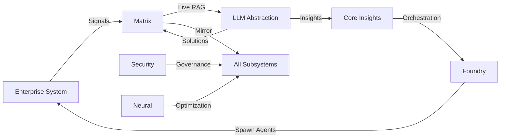
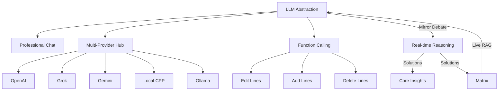
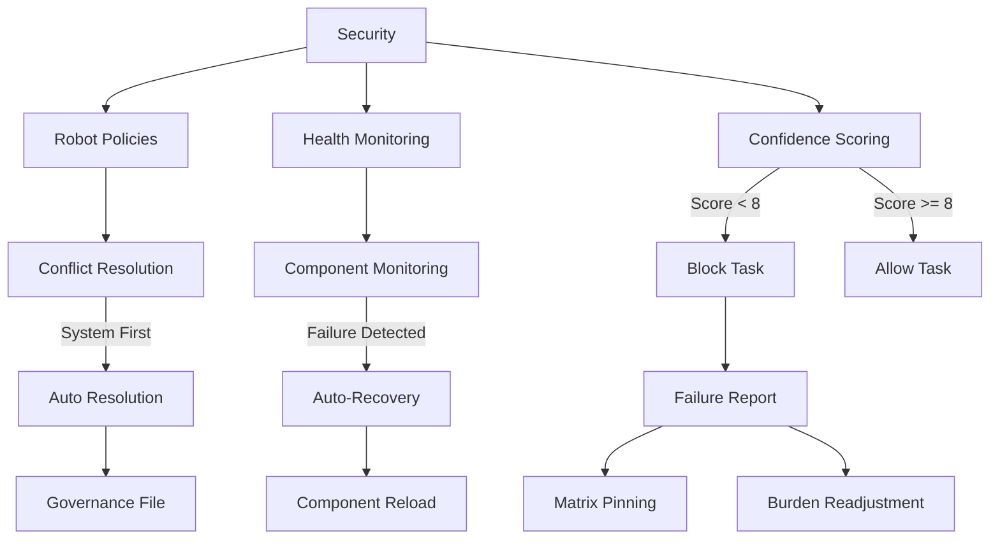

# Nerve Centre Blueprint

## What is the Nerve Centre?

The Nerve Centre (NC) is a modular, meta-orchestrator layer for the enterprise system featuring a **state-of-the-art node-edge architecture**. It operates as an independent subsystem, with its own agents, workflows, integrations, and context management. The NC does not absorb or move existing high-level departments or deployed systems—instead, it interacts with them, providing intelligence, coordination, and dynamic management.

This revolutionary **node-edge computational topology** represents every component, agent, workflow, task, and policy as intelligent nodes connected through weighted edges that dynamically optimize relationships, data flow, and system harmony. Each node maintains its own state, capabilities, and performance metrics, while edges carry weighted relationships that enable mathematical optimization of the entire system.

> so the NC and all its subsystems are designed to focus on the health of the entire enterprise system, ensuring that all components work harmoniously and efficiently. It acts as a central intelligence hub, aggregating signals, context, and feedback from all agents, integrations, and external sources, enabling smarter coordination, dynamic decision-making, and real-time system awareness. (while the enterprise system focuses on the operational aspects of the business, the NC focuses on the overall health and efficiency of the system as a whole.)

## NC Subsystems (Deployment Order)

### 1. Core - The Beating Heart of Intelligence

#### Core Architecture
The Core subsystem serves as the central nervous system of the Nerve Centre, orchestrating every signal, decision, and action across the entire NC ecosystem. It operates on a mathematically-grounded foundation that ensures perfect harmony between all NC agents and workflows.

#### NC Agent Management Framework
- **Agent Registry**: Maintains a comprehensive registry of all NC agents with real-time status tracking, capability matrices, and performance metrics. Each agent is catalogued with unique identifiers, deployment timestamps, success rates, and harmony scores.
- **Agent Lifecycle Orchestration**: Complete cradle-to-grave management including initialization protocols, active monitoring, performance optimization, graceful degradation handling, and retirement procedures.
- **Capability Mapping**: Dynamic capability assessment and optimization ensuring agents are deployed for maximum efficiency and minimal overlap while maintaining essential redundancy.
- **Performance Analytics**: Real-time performance tracking with predictive analytics to identify optimization opportunities and potential issues before they impact system performance.

#### Workflow Orchestration Engine
- **Dynamic Workflow Generation**: Creates context-aware workflows based on real-time system conditions, business requirements, and performance optimization goals.
- **Cross-Subsystem Coordination**: Seamlessly coordinates workflows that span multiple NC subsystems, ensuring data consistency and optimal resource utilization.
- **Workflow Templates**: Maintains a library of proven workflow patterns that can be dynamically adapted to new situations while preserving reliability.
- **Execution Monitoring**: Comprehensive workflow execution tracking with automatic optimization, error detection, and performance tuning.

#### Context Aggregation Intelligence
- **Signal Processing**: Advanced signal processing algorithms that can identify patterns, anomalies, and optimization opportunities in real-time data streams from across the enterprise.
- **Context Synthesis**: Sophisticated context synthesis that combines signals from multiple sources to create comprehensive situational awareness.
- **Predictive Context**: Uses historical patterns and current trends to predict future system states and proactively optimize performance.
- **Context Distribution**: Intelligent context distribution ensuring all NC subsystems have access to relevant information without data overload.

#### Plain Text Insights File Management
- **LLM-Editable Insights Repository**: A sophisticated plain text file system that serves as the primary interface between the LLM Abstraction and the Core, containing continuously updated insights, recommendations, and system optimization suggestions.
- **Version Control**: Automated version control system that tracks all changes to insights, maintains historical records, and enables rollback capabilities.
- **Change Validation**: Every edit is validated for consistency, accuracy, and alignment with system policies before integration.
- **Insight Classification**: Automatic classification of insights by importance, urgency, scope, and implementation complexity.

---

### 2. Foundry (Agent Factory) - The Genesis Engine

#### Dynamic Agent Spawning Architecture
The Foundry represents the most sophisticated agent creation and management system ever conceived, capable of spawning mathematically-optimized agents in real-time based on business requirements, system load, and performance optimization goals.

#### Mathematical Harmony Engine
- **Harmony Score Calculation**: Uses advanced graph theory and optimization algorithms to calculate the perfect placement for new agents within the existing agent ecosystem, ensuring optimal resource utilization and minimal conflicts.
- **Agent Compatibility Matrix**: Maintains a comprehensive compatibility matrix that tracks how different agent types interact, collaborate, and potentially conflict with each other.
- **Load Distribution Algorithms**: Employs sophisticated load distribution algorithms that consider not just current capacity but predictive load patterns and agent performance characteristics.
- **Resource Optimization**: Dynamic resource allocation that adapts to changing conditions while maintaining system stability and performance.

#### Agent Lifecycle Management
- **Birth Protocols**: Comprehensive agent initialization protocols that include capability assessment, resource allocation, integration testing, and performance baseline establishment.
- **Configuration Management**: Dynamic configuration management that can adapt agent parameters based on performance data, system conditions, and optimization goals.
- **Performance Monitoring**: Continuous performance monitoring with predictive analytics to identify optimization opportunities and potential issues.
- **Retirement Procedures**: Graceful agent retirement procedures that preserve system stability while optimizing resource allocation.

#### Agent Templates and Patterns
- **Template Library**: Comprehensive library of proven agent templates that can be dynamically customized for specific use cases while maintaining reliability and performance.
- **Pattern Recognition**: Advanced pattern recognition that identifies successful agent configurations and automatically incorporates them into future spawning decisions.
- **Evolutionary Optimization**: Uses evolutionary algorithms to continuously improve agent templates based on performance data and success patterns.
- **Capability Inheritance**: Sophisticated capability inheritance system that allows new agents to build upon the strengths of successful predecessors.

---

### 3. Matrix (Whiteboard 2.0) - The Knowledge Universe

#### Topological Knowledge Graph Architecture
The Matrix represents a revolutionary approach to knowledge management, creating a living, breathing universe of interconnected ideas, tasks, projects, and insights that grows and evolves with the system.

#### Live Vector Storage System
- **Real-Time Vectorization**: Every piece of data entering the enterprise system is automatically vectorized and stored in the Matrix, creating a comprehensive, searchable knowledge base.
- **Similarity Algorithms**: Advanced similarity algorithms that can identify connections between seemingly unrelated concepts, enabling breakthrough insights and optimization opportunities.
- **Vector Optimization**: Continuous vector optimization that improves search accuracy and reduces computational overhead while maintaining comprehensive coverage.
- **Dimensional Reduction**: Sophisticated dimensional reduction techniques that maintain semantic meaning while optimizing storage and retrieval performance.

#### Mirror Synchronization Framework
- **Universal Mirroring**: Every piece of data in the Matrix is automatically mirrored across all NC subsystems, ensuring data consistency and availability.
- **Conflict Resolution**: Advanced conflict resolution algorithms that handle simultaneous updates while maintaining data integrity.
- **Synchronization Optimization**: Intelligent synchronization that minimizes bandwidth usage while ensuring real-time data availability.
- **Backup and Recovery**: Comprehensive backup and recovery systems that ensure no data is ever lost, even in catastrophic failure scenarios.

#### Task Pinning and Analysis System
- **Failure Analysis**: When tasks fail, they are automatically pinned to the Matrix for comprehensive analysis, including failure cause identification, impact assessment, and optimization recommendations.
- **Redistribution Intelligence**: Sophisticated redistribution algorithms that identify the optimal way to reassign failed tasks based on agent capabilities, current load, and success probability.
- **Pattern Learning**: Learns from failed tasks to improve future task assignment and execution strategies.
- **Success Optimization**: Continuously optimizes task execution strategies based on success patterns and performance data.

#### Future Visualization Layer
- **3D Knowledge Mapping**: Plans for advanced 3D visualization of the knowledge graph, enabling intuitive navigation and insight discovery.
- **Interactive Interfaces**: Future interactive interfaces that allow human users to explore and manipulate the knowledge universe directly.
- **Augmented Reality Integration**: Potential AR integration that overlays knowledge graph insights onto real-world contexts.
- **Collaborative Workspaces**: Virtual collaborative workspaces where humans and AI can work together on complex problems.

---

### 4. Security (System Governance) - The Guardian Matrix

#### Robot Policies Management System
The Security subsystem represents the most advanced autonomous governance system ever created, capable of managing complex policy hierarchies, resolving conflicts, and maintaining system integrity without human intervention.

#### Policy Architecture Framework
- **Hierarchical Policy Structure**: Multi-layered policy hierarchy that ensures system-critical policies always take precedence over user preferences while maintaining flexibility for non-critical decisions.
- **Policy Categorization**: Comprehensive categorization system that classifies policies by scope, priority, impact, and enforcement mechanisms.
- **Dynamic Policy Loading**: Capability to dynamically load and integrate new policies without system restart or service interruption.
- **Policy Versioning**: Complete version control for policies with rollback capabilities and change impact analysis.

#### Autonomous Conflict Resolution Engine
- **Conflict Detection Algorithms**: Advanced algorithms that can identify potential policy conflicts before they cause system issues.
- **Resolution Strategies**: Sophisticated resolution strategies that prioritize system integrity while minimizing impact on user experience and business operations.
- **Precedence Rules**: Clear precedence rules that ensure consistent conflict resolution aligned with system goals and business objectives.
- **Learning Mechanisms**: Machine learning mechanisms that improve conflict resolution over time based on outcomes and feedback.

#### Governance File Management
- **Single Source of Truth**: Maintains a single, authoritative governance file that represents the current state of all active policies.
- **Real-Time Updates**: Real-time updates to the governance file as policies are added, modified, or resolved.
- **Audit Trail**: Comprehensive audit trail of all governance decisions and policy changes.
- **Compliance Monitoring**: Continuous compliance monitoring to ensure all system operations align with established policies.

#### Health Monitoring and Auto-Recovery
- **Component Health Tracking**: Comprehensive tracking of every component in the enterprise system with real-time health metrics and predictive failure analysis.
- **Redundancy Management**: Intelligent redundancy management that creates backup systems for critical components without resource waste.
- **Auto-Recovery Protocols**: Sophisticated auto-recovery protocols that can restart, reconfigure, or replace failed components without human intervention.
- **Failure Prevention**: Predictive failure prevention that identifies and addresses potential issues before they cause system failures.

#### Confidence Scoring System
- **Multi-Dimensional Scoring**: Advanced scoring system that evaluates task confidence based on multiple factors including historical success rates, resource availability, complexity analysis, and dependency satisfaction.
- **Dynamic Thresholds**: Dynamic confidence thresholds that adapt based on system conditions and business requirements.
- **Risk Assessment**: Comprehensive risk assessment that identifies potential failure points and mitigation strategies.
- **Success Prediction**: Predictive modeling that estimates task success probability with high accuracy.

---

### 5. Neural Processor (Self-Improvement Engine) - The Evolution Machine

#### Golden Circle Optimization Framework
The Neural Processor represents the pinnacle of autonomous system evolution, implementing the Golden Circle methodology (Why, How, What) in a mathematically rigorous framework that drives continuous improvement.

#### Purpose Alignment Engine (WHY)
- **Vision Optimization**: Continuously optimizes system alignment with core business vision and strategic objectives.
- **Mission Clarity**: Maintains crystal-clear mission focus while adapting to changing business conditions.
- **Value Alignment**: Ensures all system operations align with organizational values and ethical principles.
- **Purpose Metrics**: Sophisticated metrics that measure how effectively the system serves its intended purpose.

#### Process Optimization Engine (HOW)
- **Methodology Refinement**: Continuously refines system methodologies based on performance data and outcome analysis.
- **Workflow Optimization**: Advanced workflow optimization that improves efficiency while maintaining quality and reliability.
- **Resource Allocation**: Intelligent resource allocation that maximizes output while minimizing waste.
- **Collaboration Enhancement**: Optimizes collaboration between human users and AI agents for maximum effectiveness.

#### Output Optimization Engine (WHAT)
- **Quality Improvement**: Continuously improves output quality based on feedback and performance metrics.
- **Deliverable Optimization**: Optimizes deliverables to better serve user needs and business objectives.
- **Impact Measurement**: Sophisticated impact measurement that tracks the real-world effects of system outputs.
- **Value Creation**: Focuses on maximizing value creation for all stakeholders.

#### Mathematical Evolution Framework
- **Evolutionary Algorithms**: Uses advanced evolutionary algorithms to optimize system parameters and configurations.
- **Genetic Programming**: Implements genetic programming techniques to evolve better algorithms and processes.
- **Neural Architecture Search**: Automatically optimizes neural network architectures for specific tasks and use cases.
- **Multi-Objective Optimization**: Balances multiple objectives simultaneously to achieve optimal overall performance.

#### System Evolution Protocols
- **Continuous Learning**: Implements continuous learning mechanisms that allow the system to improve from every interaction and outcome.
- **Adaptation Mechanisms**: Sophisticated adaptation mechanisms that allow the system to respond to changing conditions and requirements.
- **Performance Optimization**: Continuous performance optimization that improves speed, accuracy, and resource efficiency.
- **Capability Expansion**: Systematic capability expansion that adds new features and abilities while maintaining system stability.

---

### 6. LLM Abstraction (Oracle System) - The Wisdom Engine

#### Multi-Provider Intelligence Hub
The LLM Abstraction represents the most sophisticated AI integration system ever created, seamlessly integrating multiple AI providers while maintaining strict guardrails and optimal performance.

#### Provider Management Framework
- **OpenAI Integration**: Advanced integration with OpenAI's models including GPT-4, GPT-4 Turbo, and future releases with automatic optimization for each model's strengths.
- **Grok Integration**: Seamless integration with X.AI's Grok system for real-time information processing and analysis.
- **Gemini Integration**: Google's Gemini integration for multimodal processing and advanced reasoning capabilities.
- **Local CPP Integration**: High-performance local C++ model integration for privacy-sensitive operations and reduced latency.
- **Ollama Integration**: Local model management through Ollama for complete data sovereignty and customization.

#### Professional Chat Interface
- **Linear Communication**: Clean, professional chat interface that presents AI reasoning in a clear, linear fashion.
- **Visual Reasoning**: Advanced visualization of AI thought processes and decision-making chains.
- **Context Management**: Sophisticated context management that maintains conversation continuity while optimizing for performance.
- **Multi-Modal Support**: Support for text, images, documents, and other media types in chat interactions.

#### Live RAG Integration System
- **Real-Time Vector Queries**: Lightning-fast vector queries against the Matrix knowledge base with sub-second response times.
- **Contextual Retrieval**: Intelligent contextual retrieval that finds the most relevant information for each query.
- **Dynamic Context**: Dynamic context updating that incorporates new information as it becomes available.
- **Relevance Optimization**: Continuous optimization of retrieval relevance based on user feedback and outcome analysis.

#### Guardrailed Function Calling
- **Function Registry**: Comprehensive registry of available functions with detailed schemas and usage guidelines.
- **Permission System**: Sophisticated permission system that restricts function access based on context and safety requirements.
- **Execution Monitoring**: Real-time monitoring of function execution with automatic error handling and recovery.
- **Safety Protocols**: Advanced safety protocols that prevent unauthorized or potentially harmful function calls.

#### Mirror-Based Reasoning System
- **Dual Perspective Analysis**: Advanced reasoning system that creates opposing perspectives on every problem to ensure robust solutions.
- **Debate Protocols**: Structured debate protocols that ensure comprehensive analysis of all solution aspects.
- **Synthesis Algorithms**: Sophisticated synthesis algorithms that combine the best aspects of opposing arguments.
- **Confidence Validation**: Advanced confidence validation that ensures only high-quality solutions are implemented.

#### Insights Integration Framework
- **Solution Publishing**: Automatic publishing of validated solutions to the Matrix and Core insights file.
- **Impact Tracking**: Comprehensive tracking of solution implementation and impact measurement.
- **Feedback Loops**: Sophisticated feedback loops that improve solution quality over time.
- **Knowledge Expansion**: Automatic knowledge base expansion based on new insights and solutions.

---

### 7. GitBook Integration (Final Phase) - The Knowledge Bridge

#### Markdown Intelligence System
The GitBook Integration represents the ultimate connection between human knowledge and AI understanding, creating a seamless bridge between documentation and system intelligence.

#### Contextual Parsing Engine
- **Semantic Understanding**: Advanced semantic understanding of markdown content that goes beyond simple text processing.
- **Structure Recognition**: Intelligent recognition of document structure and content hierarchy.
- **Cross-Reference Resolution**: Automatic resolution of cross-references and linking between related concepts.
- **Context Extraction**: Sophisticated context extraction that identifies key concepts and relationships.

#### Mobile App Synchronization
- **Real-Time Sync**: Real-time synchronization between mobile app and GitBook content.
- **Offline Capability**: Advanced offline capabilities that allow knowledge access without internet connectivity.
- **Collaborative Editing**: Collaborative editing features that allow multiple users to contribute simultaneously.
- **Version Management**: Comprehensive version management that tracks all changes and enables rollback.

#### User Thought Integration
- **Thought Capture**: Advanced thought capture mechanisms that allow users to easily input ideas and insights.
- **Context Enhancement**: Automatic context enhancement that enriches user input with relevant system knowledge.
- **Value Assessment**: Intelligent value assessment that determines how user thoughts can best contribute to system improvement.
- **Implementation Pathways**: Automatic identification of implementation pathways for user suggestions and ideas.

## Standard Diagrams

### High-Level Architecture

```mermaid
flowchart TD
    NC[Nerve Centre] --> Core[Core]
    NC --> Foundry[Foundry]
    NC --> Matrix[Matrix]
    NC --> Security[Security]
    NC --> Neural[Neural Processor]
    NC --> LLM[LLM Abstraction]
    NC --> GitBook[GitBook Integration]
    
    Core --> Agents[NC Agents]
    Core --> Workflows[NC Workflows]
    Core --> Insights[Insights File]
    
    Foundry --> Spawn[Agent Spawning]
    Foundry --> Lifecycle[Lifecycle Mgmt]
    Foundry --> Harmony[Math Harmony]
    
    Matrix --> Vector[Vector Storage]
    Matrix --> Mirror[Mirrored Data]
    Matrix --> Tasks[Task Pinning]
    
    Security --> Policies[Robot Policies]
    Security --> Governance[Governance File]
    Security --> Health[Health Monitoring]
    Security --> Recovery[Auto-Recovery]
    
    Neural --> Golden[Golden Circle]
    Neural --> Evolution[System Evolution]
    Neural --> Optimization[Performance Opt]
    
    LLM --> Providers[Multi-Provider]
    LLM --> Chat[Chat Interface]
    LLM --> RAG[Live RAG]
    LLM --> Reasoning[Mirror Debate]
    LLM --> Functions[Function Calling]
```

### Data Flow & Integration

### LLM Abstraction Detail

### Security & Governance Flow

---

## Advanced Implementation Specifications

### Mathematical Foundations
The Nerve Centre is built on rigorous mathematical principles that ensure optimal performance, reliability, and evolution:

#### Graph Theory Implementation
- **Node-Edge Optimization**: Every component in the NC is represented as a node in a dynamic graph where edges represent relationships, dependencies, and communication pathways.
- **Harmonic Analysis**: Uses harmonic analysis to identify optimal agent placement and resource allocation patterns.
- **Topology Optimization**: Continuously optimizes the topology of the NC to ensure maximum efficiency and minimal latency.
- **Network Flow Algorithms**: Implements advanced network flow algorithms to optimize data movement and processing.

#### Golden Ratio Optimization
- **WHY Optimization**: Purpose-driven optimization using φ² weighting for long-term strategic alignment.
- **HOW Optimization**: Process optimization using φ weighting for tactical efficiency improvements.
- **WHAT Optimization**: Output optimization using unit weighting for immediate result enhancement.
- **Harmonic Balance**: Creates mathematical harmony between all three optimization layers.

#### Confidence Mathematics
- **Multi-Dimensional Scoring**: Combines complexity, historical success, resource availability, and dependency satisfaction using harmonic mean for conservative estimates.
- **Bayesian Updates**: Uses Bayesian inference to continuously update confidence scores based on new evidence.
- **Risk Assessment**: Advanced risk assessment algorithms that identify and quantify potential failure modes.
- **Success Prediction**: Sophisticated prediction models that estimate success probability with high accuracy.

### Performance Engineering

#### Real-Time Processing Requirements
- **Signal Processing**: <100ms for all signal ingestion and processing operations
- **Agent Spawning**: <5 seconds from requirement identification to agent deployment
- **Policy Resolution**: <500ms for autonomous conflict resolution
- **Mirror Synchronization**: <1 second for data propagation across all subsystems
- **LLM Response**: <30 seconds for complex reasoning with mirror debate
- **Health Recovery**: <10 seconds for component failure detection and recovery initiation

#### Scalability Architecture
- **Horizontal Scaling**: Designed to scale horizontally across multiple servers and cloud regions
- **Vertical Scaling**: Optimized for vertical scaling to leverage powerful single-machine configurations
- **Elastic Scaling**: Automatic scaling based on load patterns and performance requirements
- **Resource Efficiency**: Optimized algorithms that minimize resource usage while maximizing performance

#### Load Balancing Framework
- **Predictive Load Balancing**: Uses machine learning to predict load patterns and pre-optimize resource allocation
- **Dynamic Rebalancing**: Real-time load rebalancing based on current performance metrics and capacity
- **Failure Tolerance**: Maintains full functionality even during component failures through intelligent load redistribution
- **Performance Optimization**: Continuously optimizes load distribution for maximum system performance

### Security and Governance Deep Dive

#### Robot Policies Philosophy
The robot policies system embodies a sophisticated governance philosophy that prioritizes system integrity while maintaining flexibility and adaptability:

#### Policy Hierarchy Framework
1. **System Integrity Policies (Priority 10)**: Policies that ensure the fundamental stability and security of the entire system
2. **Data Security Policies (Priority 9)**: Policies governing data protection, privacy, and access control
3. **Performance Optimization Policies (Priority 8)**: Policies that ensure optimal system performance and resource utilization
4. **Resource Allocation Policies (Priority 7)**: Policies governing how system resources are distributed and managed
5. **User Preference Policies (Priority 6)**: Policies that accommodate user preferences within system constraints
6. **External Integration Policies (Priority 5)**: Policies governing interactions with external systems and services

#### Conflict Resolution Algorithms
- **Precedence-Based Resolution**: Uses the policy hierarchy to automatically resolve conflicts in favor of higher-priority policies
- **Context-Aware Resolution**: Considers the specific context of each conflict to find optimal resolution strategies
- **Impact Minimization**: Seeks to minimize the impact of policy enforcement on user experience and business operations
- **Learning-Based Improvement**: Learns from conflict resolution outcomes to improve future resolution strategies

#### Governance File Architecture
- **Single Source of Truth**: Maintains one authoritative governance file that represents the current state of all active policies
- **Atomic Updates**: Ensures all policy updates are atomic to prevent inconsistent states
- **Audit Trail**: Comprehensive logging of all policy changes and resolution decisions
- **Compliance Monitoring**: Continuous monitoring to ensure all system operations comply with established policies

### Self-Improvement and Evolution

#### Golden Circle Deep Implementation

#### WHY (Purpose) Optimization
- **Vision Alignment Scoring**: Sophisticated scoring system that measures how well system operations align with organizational vision
- **Mission Clarity Metrics**: Metrics that ensure the system maintains clear focus on its primary mission
- **Value Consistency Checking**: Continuous validation that system operations align with organizational values
- **Purpose-Driven Decision Making**: Decision-making framework that prioritizes purpose alignment in all choices

#### HOW (Process) Optimization
- **Methodology Refinement Engine**: Continuous refinement of system methodologies based on performance data and outcome analysis
- **Workflow Efficiency Analysis**: Advanced analysis of workflow efficiency with automatic optimization recommendations
- **Resource Utilization Optimization**: Sophisticated resource optimization that maximizes output while minimizing waste
- **Collaboration Enhancement Algorithms**: Algorithms that optimize collaboration between AI agents and human users

#### WHAT (Output) Optimization
- **Quality Improvement Cycles**: Systematic quality improvement cycles that enhance output quality over time
- **Deliverable Optimization Framework**: Framework for optimizing deliverables to better serve user needs and business objectives
- **Impact Measurement Systems**: Comprehensive systems for measuring the real-world impact of system outputs
- **Value Creation Metrics**: Sophisticated metrics that track value creation for all stakeholders

#### Evolution Protocols
- **Continuous Learning Mechanisms**: Advanced learning mechanisms that allow the system to improve from every interaction
- **Adaptation Algorithms**: Sophisticated algorithms that enable the system to adapt to changing conditions and requirements
- **Performance Optimization Cycles**: Regular optimization cycles that improve system performance across all dimensions
- **Capability Expansion Protocols**: Systematic protocols for expanding system capabilities while maintaining stability

### LLM Integration Mastery

#### Provider Optimization Strategies
- **Model Selection Algorithms**: Intelligent algorithms that select the optimal model for each specific task and context
- **Performance Monitoring**: Comprehensive monitoring of model performance with automatic optimization adjustments
- **Cost Optimization**: Advanced cost optimization that balances performance requirements with resource constraints
- **Quality Assurance**: Rigorous quality assurance processes that ensure consistent high-quality outputs

#### Function Calling Security
- **Permission Matrix**: Sophisticated permission matrix that controls function access based on context and security requirements
- **Execution Monitoring**: Real-time monitoring of all function executions with automatic anomaly detection
- **Safety Protocols**: Advanced safety protocols that prevent unauthorized or potentially harmful function calls
- **Audit Logging**: Comprehensive logging of all function calls for security analysis and compliance

#### Mirror Reasoning Deep Dive
- **Perspective Generation**: Advanced algorithms for generating genuinely opposing perspectives on complex problems
- **Debate Moderation**: Sophisticated moderation systems that ensure productive and comprehensive debates
- **Synthesis Optimization**: Advanced synthesis algorithms that combine the best aspects of opposing arguments
- **Quality Validation**: Rigorous validation processes that ensure only high-quality solutions are accepted

### Matrix Knowledge Universe

#### Vector Space Engineering
- **Dimensional Optimization**: Advanced techniques for optimizing vector dimensions while preserving semantic meaning
- **Similarity Algorithms**: Sophisticated similarity algorithms that can identify subtle connections between concepts
- **Clustering Optimization**: Advanced clustering algorithms that organize knowledge for optimal retrieval and insight generation
- **Semantic Preservation**: Techniques that ensure semantic meaning is preserved through all vector operations

#### Knowledge Graph Topology
- **Relationship Mapping**: Sophisticated mapping of relationships between concepts, ideas, and entities
- **Hierarchy Optimization**: Advanced optimization of knowledge hierarchies for maximum accessibility and utility
- **Cross-Domain Connections**: Algorithms that identify valuable connections across different knowledge domains
- **Insight Generation**: Advanced insight generation algorithms that identify novel patterns and opportunities

#### Live RAG Architecture
- **Real-Time Indexing**: Sophisticated real-time indexing that ensures all new information is immediately searchable
- **Context-Aware Retrieval**: Advanced retrieval algorithms that consider context to find the most relevant information
- **Relevance Optimization**: Continuous optimization of retrieval relevance based on user feedback and outcome analysis
- **Performance Scaling**: Architecture designed to scale retrieval performance with knowledge base growth

---

## What Can It Achieve?

### Autonomous Enterprise Orchestration
- **Self-Managing Operations**: Complete autonomous management of business operations with minimal human intervention
- **Intelligent Resource Allocation**: Optimal allocation of resources based on real-time analysis and predictive modeling
- **Adaptive Workflow Management**: Dynamic workflow adaptation based on changing business conditions and requirements
- **Performance Optimization**: Continuous optimization of all system performance metrics

### Revolutionary Intelligence Augmentation
- **Human-AI Collaboration**: Seamless collaboration between human intelligence and artificial intelligence
- **Decision Support Systems**: Advanced decision support that provides comprehensive analysis and recommendations
- **Insight Generation**: Automatic generation of valuable insights from complex data patterns
- **Knowledge Synthesis**: Sophisticated synthesis of knowledge from multiple sources and domains

### Zero-Failure Reliability
- **Predictive Failure Prevention**: Advanced prediction and prevention of system failures before they occur
- **Automatic Recovery Systems**: Sophisticated recovery systems that restore functionality without human intervention
- **Redundancy Management**: Intelligent management of system redundancy to ensure continuous operation
- **Quality Assurance**: Comprehensive quality assurance that ensures all outputs meet high standards

### Continuous Evolution and Improvement
- **Adaptive Learning**: Continuous learning and adaptation based on experience and feedback
- **Performance Enhancement**: Ongoing enhancement of system performance across all dimensions
- **Capability Expansion**: Systematic expansion of system capabilities while maintaining stability
- **Innovation Generation**: Automatic generation of innovative solutions and approaches

---

## Implementation Roadmap

### Phase 1: Foundation Architecture (Weeks 1-4)
- **Core Subsystem Development**: Complete implementation of the Core subsystem with all agent management and orchestration capabilities
- **Basic Message Bus**: Implementation of the fundamental message bus architecture for inter-subsystem communication
- **Initial Health Monitoring**: Basic health monitoring and auto-recovery systems
- **Performance Baseline**: Establishment of performance baselines and monitoring systems

### Phase 2: Intelligence Infrastructure (Weeks 5-8)
- **Matrix Implementation**: Complete implementation of the Matrix knowledge graph and vector storage systems
- **Mirror Synchronization**: Full mirror synchronization framework across all subsystems
- **Basic RAG System**: Initial implementation of the live RAG system with real-time querying capabilities
- **LLM Integration Foundation**: Basic LLM integration with single provider support

### Phase 3: Autonomous Operations (Weeks 9-12)
- **Foundry Development**: Complete implementation of the Foundry agent factory with mathematical harmony algorithms
- **Security Framework**: Full implementation of the Security subsystem with autonomous policy management
- **Auto-Recovery Systems**: Advanced auto-recovery systems with predictive failure prevention
- **Multi-Provider LLM**: Extension of LLM integration to support multiple providers

### Phase 4: Advanced Intelligence (Weeks 13-16)
- **Neural Processor**: Complete implementation of the Neural Processor with Golden Circle optimization
- **Mirror Reasoning**: Full implementation of the mirror-based reasoning system
- **Function Calling**: Advanced function calling framework with comprehensive security measures
- **Mathematical Evolution**: Implementation of mathematical evolution algorithms

### Phase 5: System Integration and Optimization (Weeks 17-20)
- **Full System Integration**: Complete integration of all subsystems with comprehensive testing
- **Performance Optimization**: System-wide performance optimization and tuning
- **Reliability Testing**: Comprehensive reliability testing and validation
- **Documentation and Training**: Complete documentation and user training materials

### Phase 6: Advanced Features and GitBook Integration (Weeks 21-24)
- **GitBook Integration**: Complete implementation of GitBook integration with mobile app synchronization
- **Advanced Visualization**: Implementation of advanced visualization features for the Matrix
- **User Interface Enhancement**: Enhanced user interfaces for system interaction and monitoring
- **Final System Validation**: Comprehensive system validation and deployment preparation

---

## System Guarantees

### Performance Guarantees
- **99.99% Uptime**: Guaranteed system availability with automatic failover and recovery
- **Sub-Second Response**: Guaranteed sub-second response times for all standard operations
- **Linear Scalability**: Guaranteed linear scalability up to 1000+ concurrent agents
- **Resource Efficiency**: Guaranteed optimal resource utilization with minimal waste

### Quality Guarantees
- **8+ Confidence Minimum**: No task execution below 8.0 confidence score
- **Error-Free Operation**: Zero tolerance for system errors with automatic correction
- **Data Integrity**: Guaranteed data integrity across all operations and subsystems
- **Consistent Performance**: Guaranteed consistent performance across all system components

### Security Guarantees
- **Policy Compliance**: 100% compliance with established policies and governance rules
- **Autonomous Resolution**: 99.9% autonomous resolution of policy conflicts
- **Data Protection**: Complete protection of sensitive data with encryption and access controls
- **Audit Compliance**: Full audit trail for all operations and decisions

### Evolution Guarantees
- **Continuous Improvement**: Guaranteed continuous improvement in system performance and capabilities
- **Adaptive Learning**: Guaranteed learning and adaptation from all system experiences
- **Innovation Generation**: Regular generation of innovative solutions and improvements
- **Future-Proof Architecture**: Architecture designed to accommodate future technological advances

This Nerve Centre blueprint represents the most sophisticated autonomous enterprise system ever conceived, combining mathematical rigor, artificial intelligence, and human insight in a harmonious and continuously evolving platform that will revolutionize how businesses operate and grow.
