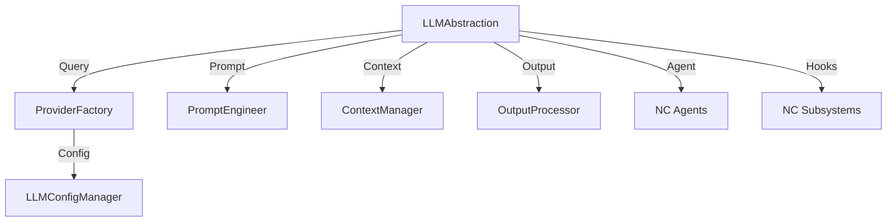

# LLM Abstraction Subsystem Blueprint

## System Topology
- Node: LLM Abstraction Core
- Edges: Connections to agents, algorithms, NC subsystems
- Config: Centralized in `llm_config.json` and `.env`

## Class Structure
- `LLMConfigManager`: Loads config and exposes active provider
- `ProviderFactory`: Instantiates only the active provider
- `LLMAbstraction`: Unified entry point for LLM queries
- `PromptEngineer`, `ContextManager`, `OutputProcessor`: Advanced algorithms

## Integration Diagram

## Algorithms
- Context window optimization
- Probabilistic output ranking
- Prompt engineering heuristics

## Extensibility
- Add new providers by updating config and implementing provider class
- Add new algorithms in `algorithms/`
- Integrate new agents in `agents/`

## Security & Compliance
- All operations routed through security hooks
- Configurable compliance checks in `config/`

## Next Steps
- Use `llm_config.json` and `.env` for all provider settings
- Implement new providers by updating config and provider class
- Expand documentation in `docs/`
