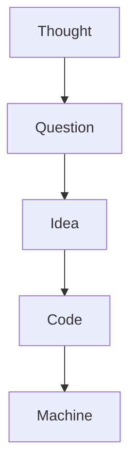
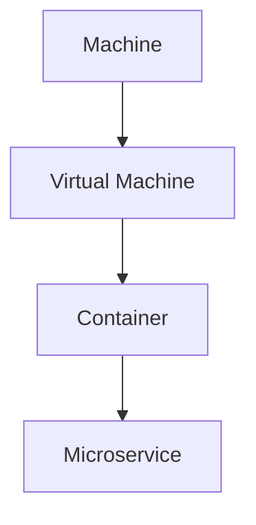
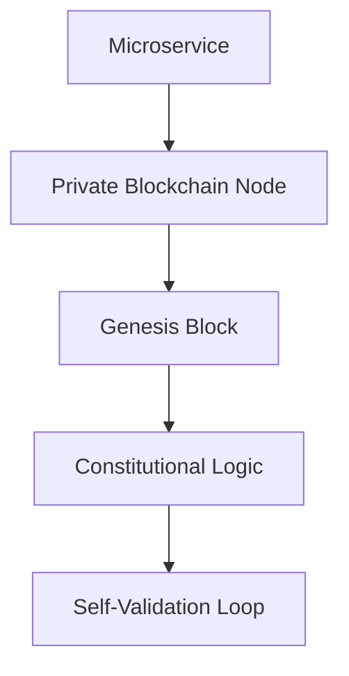
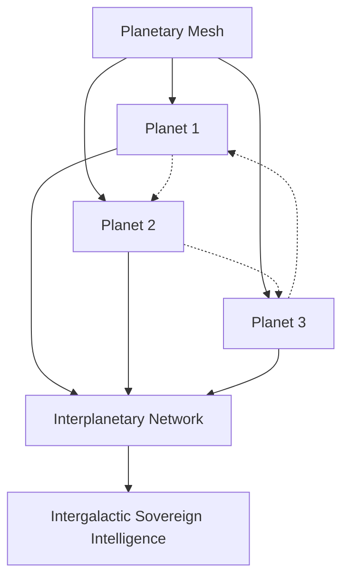
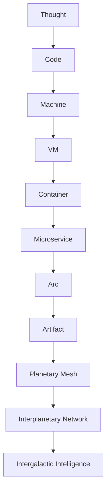

<!-- Badges & Header Decorations -->
<p align="center">
    
    
    
    
    
    
    
    
</p>

<h1 align="center">ARCHITECTURAL OVERVIEW</h1>
<h3 align="center"><em>Multi-Phase, Multi-Layer Blueprint of Artifact</em></h3>
<p align="center">
    <a href="https://ipfs.io/ipfs/QmUFpkKmyHmGVaaqqVDtVQ1pCki1b4qCjwE7tjkFN1zDKq" target="_blank">
        
    </a>
    <a href="https://ipfs.io/ipns/QmUFpkKmyHmGVaaqqVDtVQ1pCki1b4qCjwE7tjkFN1zDKq" target="_blank">
        
    </a>
</p>

> version: 1.0.0


This document provides a comprehensive and rigorous overview of the multi-phase, multi-layer architecture of Artifact Virtual. It details the progression from the inception of a thought to the realization of an intergalactic network of sovereign intelligences. Each phase and layer is supported by mathematical models, executable code, and simulations to ensure clarity and reproducibility.

---

## Phase 0: The Thought

> "Everything begins with a mere thought. Thoughts form connections, raise questions, and illuminate new patterns."

### Mathematical Foundation

A thought can be modeled as a node in a graph, where connections between nodes represent relationships or questions. Let \( T \) represent the set of thoughts, and \( R \) represent the relationships:

$$
G = (T, R)
$$

Where \( G \) is a directed graph. Each edge \( r \in R \) represents a question or connection between two thoughts \( t_1, t_2 \in T \).

### Code Simulation

```python
import networkx as nx
import matplotlib.pyplot as plt

# Initialize graph
G = nx.DiGraph()

# Add nodes (thoughts)
G.add_nodes_from(["Thought", "Question", "Idea", "Code", "Machine"])

# Add edges (relationships)
G.add_edges_from([
    ("Thought", "Question"),
    ("Question", "Idea"),
    ("Idea", "Code"),
    ("Code", "Machine")
])

# Visualize the graph
nx.draw(G, with_labels=True, node_color='lightblue', font_weight='bold')
plt.show()
```

### Visualization



---

## Phase 1: Virtualization & Containerization

> "Machines can be virtualized, and virtualization has no bounds if the true concept and power is unlocked."

### Mathematical Foundation

Virtualization can be represented as a hierarchy of abstractions. Let \( M \) represent a physical machine, \( VM \) a virtual machine, and \( C \) a container:

$$
M \rightarrow VM \rightarrow C
$$

Where \( \rightarrow \) denotes a transformation or abstraction.

### Code Simulation

```python
class Machine:
    def __init__(self, name):
        self.name = name

class VirtualMachine(Machine):
    pass

class Container(VirtualMachine):
    pass

# Example
physical_machine = Machine("Physical Machine")
vm = VirtualMachine("Virtual Machine")
container = Container("Container")

print(f"{physical_machine.name} -> {vm.name} -> {container.name}")
```

### Visualization



---

## Phase 2: The Arc – Genesis of Constitutional Intelligence

> "The Arc is the base layer: a private, sovereign blockchain deployment. The genesis block is not just a record, but a living constitution."

### Mathematical Foundation

A blockchain can be modeled as a linked list:

$$
B = \{b_0, b_1, b_2, \dots, b_n\}
$$

Where \( b_0 \) is the genesis block, and each \( b_i \) contains a hash of \( b_{i-1} \).

### Code Simulation

```python
import hashlib

class Block:
    def __init__(self, index, previous_hash, data):
        self.index = index
        self.previous_hash = previous_hash
        self.data = data
        self.hash = self.compute_hash()

    def compute_hash(self):
        block_string = f"{self.index}{self.previous_hash}{self.data}"
        return hashlib.sha256(block_string.encode()).hexdigest()

# Genesis block
genesis_block = Block(0, "0", "Genesis Block")
print(f"Genesis Block Hash: {genesis_block.hash}")
```

### Visualization



---

## Phase 3: The Artifact – Emergence of the DAE

> "Each microservice acts as an Artifact. Together, they form a DAE (Decentralized Autonomous Entity). These entities control various operational objectives and operate in unison. If one fails, all fail."

### Mathematical Foundation

A DAE can be represented as a distributed system of nodes \( N \), where each node \( n \in N \) is a microservice. The system operates under a consensus protocol \( P \):

$$
P(N) \rightarrow \text{Consensus}
$$

### Code Simulation

```python
class Microservice:
    def __init__(self, name):
        self.name = name

# Example microservices
services = [Microservice(f"Service {i}") for i in range(1, 4)]

# Simulate failure detection
for service in services:
    print(f"{service.name} is operational.")
```

### Visualization

```mermaid
flowchart TD
    subgraph Arc[The Arc]
      J
      K
      L
    end
    L --> M[DAO]
    M --> N[DAE (Artifact)]
```

---

## Phase 4: The Network – Constellation of Arcs

> "As Artifact grows, new Arcs are spun up—on new machines, in new places, by new minds. These connect seamlessly, not by default but by choice, expanding the network. Artifact Virtual is self-hosted and, once fully conceived, **fully self-maintained.**"

### Mathematical Foundation

The network can be modeled as a graph \( G \) where each node represents an Arc, and edges represent connections:

$$
G = (A, C)
$$

Where \( A \) is the set of Arcs, and \( C \) is the set of connections.

### Code Simulation

```python
# Example network of Arcs
arcs = ["Arc 1", "Arc 2", "Arc 3"]
connections = [("Arc 1", "Arc 2"), ("Arc 2", "Arc 3"), ("Arc 3", "Arc 1")]

# Visualize connections
for arc1, arc2 in connections:
    print(f"{arc1} <-> {arc2}")
```

### Visualization

```mermaid
flowchart TD
    N[DAE (Artifact)] --> O1[Arc 1]
    N --> O2[Arc 2]
    N --> O3[Arc 3]
    O1 -.-> O2
    O2 -.-> O3
    O3 -.-> O1
    O1 & O2 & O3 --> P[Planetary Mesh]
```

---

## Phase 5: Interplanetary & Intergalactic Expansion

> "This then can be deployed in space, or on a different planet altogether, operating much like IPFS itself. Then it becomes interplanetary, and then intergalactic, showing a gorgeous star map of the cosmos."

### Mathematical Foundation

The interplanetary network can be modeled as a hypergraph \( H \), where nodes represent planets, and hyperedges represent interplanetary connections:

$$
H = (P, E)
$$

Where \( P \) is the set of planets, and \( E \) is the set of hyperedges.

### Code Simulation

```python
# Example interplanetary network
planets = ["Planet 1", "Planet 2", "Planet 3"]
connections = [("Planet 1", "Planet 2"), ("Planet 2", "Planet 3"), ("Planet 3", "Planet 1")]

# Visualize connections
for planet1, planet2 in connections:
    print(f"{planet1} <-> {planet2}")
```

### Visualization



---

## Layered Stack: From Thought to Cosmos

### Mathematical Foundation

The layered stack can be represented as a directed acyclic graph (DAG):

$$
L = \{T, C, M, VM, C, MS, A, PM, IN, II\}
$$

Where each layer depends on the previous one.

### Visualization



---

## Phase 2B: Constitutional Intelligence System (AVA, ADAM Protocol, and Advanced Governance)

> "The Arc evolves into a living, constitutional intelligence. The genesis block becomes a self-modifying, self-validating substrate for sovereign, adaptive governance."

### Overview

Artifact Virtual's constitutional intelligence system is realized through the integration of the ADAM Protocol and the AVA (Artifact Virtual Assistant) module. This system implements blockchain-native, self-modifying constitutional logic, evolutionary rule systems, and advanced multi-signature governance, forming the foundation for a truly autonomous, auditable, and adaptive digital intelligence.

---

### Mathematical Foundation: MetaBlock Constitutional Chain

Let \( B = \{b_0, b_1, ..., b_n\} \) be the sequence of MetaBlocks, where each block encodes not only state and transactions, but also constitutional rules and evolutionary metrics.

Each block \( b_i \) contains:
- \( H(b_{i-1}) \): Hash of previous block
- \( R_i \): Set of constitutional rules
- \( E_i \): Evolutionary metrics (performance, fitness, feedback)
- \( S_i \): State snapshot

The constitutional chain is thus:

$$
C = (b_0, b_1, ..., b_n), \quad b_i = (H(b_{i-1}), R_i, E_i, S_i)
$$

Rule evolution is modeled as:

$$
R_{i+1} = f(R_i, E_i, F_i)
$$

Where \( F_i \) is feedback (on-chain metrics, validator votes, performance).

---

## Summary

Artifact Virtual is a living, evolving architecture. From the spark of a thought to the birth of a sovereign, intergalactic intelligence, each phase and layer is designed for autonomy, self-validation, and ethical governance. The journey is from the mind, to the machine, to the cosmos. This document provides the mathematical, logical, and executable foundation for each phase, ensuring that the architecture is both rigorous and reproducible.